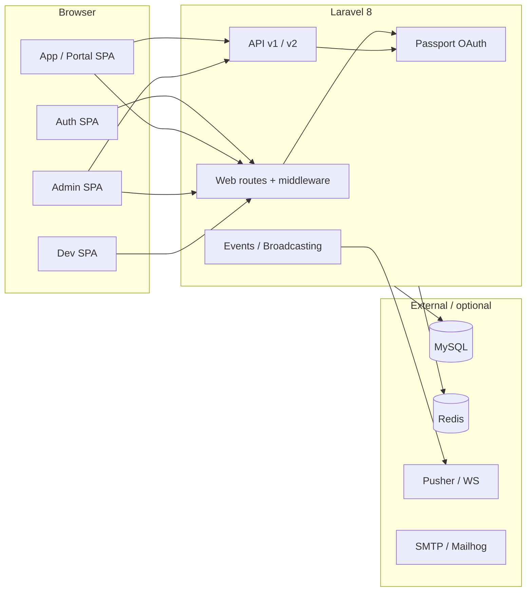

# Beyound Portal — Project Documentation

↑ [[Entities/Projects/Beyound|Beyound]]

This guide describes the **Beyound Portal**: a Laravel 8 monolith that serves multiple React single-page applications (SPAs), a JSON API (`/api/v1` and `/api/v2`), OAuth2 via Laravel Passport, and real-time features (Pusher / Laravel Echo). Use it for onboarding, operations, and day-to-day development.

## Links

- [[Entities/Projects/Beyound]]

---

## Table of contents

1. [What this project is](#1-what-this-project-is)
2. [Architecture at a glance](#2-architecture-at-a-glance)
3. [Technology stack](#3-technology-stack)
4. [Repository layout](#4-repository-layout)
5. [Prerequisites](#5-prerequisites)
6. [Local setup](#6-local-setup)
7. [Environment configuration](#7-environment-configuration)
8. [Database and migrations](#8-database-and-migrations)
9. [Authentication and authorization](#9-authentication-and-authorization)
10. [HTTP routing](#10-http-routing)
11. [API surface](#11-api-surface)
12. [Frontend applications](#12-frontend-applications)
13. [Assets, build, and PWA](#13-assets-build-and-pwa)
14. [Real-time messaging and broadcasting](#14-real-time-messaging-and-broadcasting)
15. [Background jobs, cache, and Redis](#15-background-jobs-cache-and-redis)
16. [Integrations](#16-integrations)
17. [Development workflow](#17-development-workflow)
18. [Testing](#18-testing)
19. [Deployment notes](#19-deployment-notes)
20. [Security and operational notes](#20-security-and-operational-notes)
21. [Troubleshooting](#21-troubleshooting)

---

## 1. What this project is

The portal supports **staff** and **admin** workflows (under `/portal` and `/admin`), **client** access, and a large **REST-style API** grouped around “bund” concepts (staff, clients, requests, library, chat, marketing records, etc.). The default authenticated web guard is **`member`** (staff); separate guards exist for **admin**, **client**, and API token access.

**Entry URLs (from `RouteServiceProvider`):**

| Constant | Path      | Typical use                                                |
| -------- | --------- | ---------------------------------------------------------- |
| `PORTAL` | `/portal` | Staff SPA (member)                                         |
| `ADMIN`  | `/admin`  | Admin SPA                                                  |
| `CLIENT` | `/home`   | Client-facing home (as defined in code comments/constants) |

---

## 2. Architecture at a glance



- **Server-rendered shells** load Blade views that mount React bundles from `public/js/dist/*`.
- **API** is consumed by the SPAs (axios) and third-party clients using **Bearer tokens** (Passport).
- **CreateFreshApiToken** middleware on web/admin/member groups issues short-lived API tokens for same-origin SPA calls while the user has a session.

---

## 3. Technology stack

### Backend

| Component          | Version / notes                                                    |
| ------------------ | ------------------------------------------------------------------ |
| PHP                | `^7.3 \| ^8.0` (Composer); `package.json` engines mention `^8.0.6` |
| Laravel            | `^8.65`                                                            |
| Laravel Passport   | `^10.1` — OAuth2, API guards                                       |
| MySQL              | Primary database (`^8.0` in engines)                               |
| Predis             | Redis client                                                       |
| Laravel WebSockets | `beyondcode/laravel-websockets`                                    |
| CORS               | `fruitcake/laravel-cors`                                           |
| PDF                | `barryvdh/laravel-dompdf`                                          |
| Images             | `buglinjo/laravel-webp`                                            |
| Markdown           | `graham-campbell/markdown`                                         |
| Notifications      | Slack, Telegram, Twilio channels                                   |

### Frontend

| Component                | Notes                                 |
| ------------------------ | ------------------------------------- |
| React                    | `^17`                                 |
| React Router             | v5 (`react-router-dom` `^5.3`)        |
| Material UI              | v4 (`@material-ui/*`)                 |
| Laravel Mix              | `^6` — Webpack wrapper                |
| Axios                    | HTTP client, CSRF from meta tag       |
| Laravel Echo + Pusher JS | Real-time                             |
| Workbox                  | Service workers for PWA-style caching |
| Firebase                 | Client SDK (optional features)        |
| Sass                     | Multiple entry stylesheets            |

### Auxiliary Node server

- `server/index.js` — Express + Socket.IO experiment/helper; `npm run devops` runs Mix watch alongside `nodemon` on this server. Configure `NODEJS_SERVER_PORT` and related `.env` for Pusher bridge variables if you use it.

---

## 4. Repository layout

High-level map (not exhaustive):

| Path                               | Purpose                                                                          |
| ---------------------------------- | -------------------------------------------------------------------------------- |
| `app/Http/Controllers/`            | Web + API controllers (including `api/v1`, `Admin`, `Staff`, `Auth`)             |
| `app/Http/Middleware/`             | Custom middleware (activity, cache, CORS legacy, etc.)                           |
| `app/Models/`                      | Eloquent models (`User`, `Client`, `Contact`, chat/library-related models, etc.) |
| `app/Events/`, `app/Listeners/`    | Broadcasting and domain events                                                   |
| `routes/web/`                      | Split web routes: `auth.php`, `admin.php`, `staff.php`, `dev.php`                |
| `routes/api/v1/`, `routes/api/v2/` | API route files                                                                  |
| `resources/js/src/`                | React sources: `auth/`, `app/`, `admin/`, `dev/`, `bootstrap.js`, `firebase/`    |
| `resources/sass/`                  | Sass entrypoints compiled to `public/css/dist/*`                                 |
| `resources/views/`                 | Blade templates mounting React roots                                             |
| `database/migrations/`             | Schema (users, clients, OAuth, chat, library, marketing, etc.)                   |
| `public/`                          | Compiled assets, service worker scripts, static files                            |
| `server/`                          | Optional Node server                                                             |
| `tests/`                           | PHPUnit tests                                                                    |
| `config/`                          | Standard Laravel config; see `auth.php`, `broadcasting.php`, `cors.php`          |

---

## 5. Prerequisites

Install on your machine:

- **PHP** 7.3+ or 8.x with extensions Laravel needs (`openssl`, `pdo`, `mbstring`, `tokenizer`, `xml`, `ctype`, `json`, `bcmath`, etc.)
- **Composer** 2.x
- **Node.js** 14+ (per `package.json` engines) and **npm** 7+
- **MySQL** 8 (recommended)
- **Redis** (optional but used in code paths such as `Redis::publish` in routes)
- **Git**

On Windows, use **Laravel Valet for Windows**, **Laragon**, **WSL2**, or a manual PHP + MySQL stack; ensure `php`, `composer`, and `npm` are on your `PATH`.

---

## 6. Local setup

From the project root (`portal/`):

```bash
# 1. PHP dependencies
composer install

# 2. Environment file
copy .env.example .env   # Windows; use cp on Unix
php artisan key:generate

# 3. Database — edit .env: DB_* credentials, then:
php artisan migrate

# 4. Passport keys and clients (required for API)
php artisan passport:install

# 5. JavaScript dependencies
npm install

# 6. Development assets
npm run dev
# or watch:
npm run watch
```

Serve the application:

```bash
php artisan serve
```

Visit `http://127.0.0.1:8000` (or your virtual host). Exact login URLs depend on `routes/web/auth.php` (e.g. `/entrée`, `/client/authorization`).

**Optional — full frontend + Node server (polling watch on some setups):**

```bash
npm run devops
```

This runs `mix watch` with polling (`portal` script) and `nodemon server/index.js` per `package.json`.

---

## 7. Environment configuration

Copy `.env.example` to `.env` and set at minimum:

| Variable group                    | Purpose                                      |
| --------------------------------- | -------------------------------------------- |
| `APP_*`                           | Name, environment, debug, URL                |
| `DB_*`                            | MySQL connection                             |
| `REDIS_*`                         | Cache, queue, pub/sub if used                |
| `SESSION_*`, `CACHE_*`, `QUEUE_*` | Session and queue drivers                    |
| `MAIL_*`                          | Outbound mail (local dev often uses Mailhog) |
| `PUSHER_*`, `MIX_PUSHER_*`        | Broadcasting and frontend Echo               |
| `AWS_*`                           | File storage if using S3                     |

**Passport cookie:** `AuthServiceProvider` sets `Passport::cookie('BUND-X-TOKEN')`. Frontend and proxies must allow this cookie on your domain if you rely on cookie-based token bridging.

**Broadcasting:** `config/broadcasting.php` defaults to `pusher` when `BROADCAST_DRIVER` is unset; `.env.example` uses `log` for local safety—switch to `pusher` when testing real-time features.

---

## 8. Database and migrations

Migrations live in `database/migrations/`. They include:

- **Users and auth:** `users`, `password_resets`, `sessions`
- **Passport OAuth:** `oauth_*` tables
- **Domain:** `clients`, `contacts`, `client_records`, `user_records`, `services`, `service_lists`, `library`, `directories`, `colors`, `fonts`, `quotes`, `comments`, `codes`, `cards`
- **Chat:** `rooms`, `messages`, `chat_records`, `storage_records`
- **Requests:** `client_requests`, `user_requests`
- **Marketing / ads:** `campaigns`, `campaign_records`, `ads`, `ad_sets`, `marketing_records`, `social_media_accounts`, `social_media_ad_accounts`
- **Jobs / websockets:** `jobs`, `failed_jobs`, `websockets_statistics_entries`

Run:

```bash
php artisan migrate
php artisan migrate:fresh --seed   # only if seeds exist and you accept data loss
```

---

## 9. Authentication and authorization

### Guards and providers (`config/auth.php`)

| Guard        | Driver   | Provider  | Typical use                                 |
| ------------ | -------- | --------- | ------------------------------------------- |
| `web`        | session  | `users`   | Legacy / generic                            |
| `admin`      | session  | `master`  | Admin UI                                    |
| `member`     | session  | `staff`   | Portal staff (**default** `defaults.guard`) |
| `client`     | session  | `clients` | Client browser sessions                     |
| `api`        | passport | `master`  | Staff/admin API tokens                      |
| `client-api` | passport | `clients` | Client API tokens                           |

`master` and `staff` both use the **`User`** model; **`Client`** is separate.

### Passport (`AuthServiceProvider`)

- OAuth routes are registered under **`/api/v1/bund-oauth`** (not the default `/oauth`).
- Token abilities (scopes) include: `owner`, `admin`, `moderator`, `developer`, `marketing-manager`, `marketing-analyst`, `member`, `client`, `guest`, `full`.
- Default scope: **`member`**.
- Token lifetimes: access 15 days, refresh 30 days, personal access 6 months (see `boot()`).
- **Implicit grant** is enabled.

API routes often combine `auth:api` or `auth:api,client-api` with `scope:...` middleware for fine-grained access.

### Web middleware groups (`app/Http/Kernel.php`)

- **`web`:** session, `StaffActivity`, `CreateFreshApiToken` (Passport), CSRF may be commented—verify before production.
- **`admin` / `member`:** similar; admin also uses `ClientActivity`.
- **`api`:** session + cookies + `StaffActivity` + `bindings` (not the minimal JSON-only API stack—this app uses session-aware API for blended auth).

Always review **CSRF** and **throttle** settings before exposing the app publicly.

---

## 10. HTTP routing

`RouteServiceProvider` loads:

| File                    | Prefix / middleware                      | Role                                           |
| ----------------------- | ---------------------------------------- | ---------------------------------------------- |
| `routes/web/auth.php`   | `web`                                    | Public site, password reset, login entrypoints |
| `routes/web/admin.php`  | `admin` + `auth:admin` + `permissions`   | Admin React shell                              |
| `routes/web/staff.php`  | `member` + `auth:member` + `permissions` | Portal React shell                             |
| `routes/web/dev.php`    | `admin`                                  | Dev tools UI                                   |
| `routes/api/v1/api.php` | `api`, prefix `api/v1`                   | Main REST API                                  |
| `routes/api/v2/api.php` | `api`, prefix `api/v2`                   | Newer API endpoints                            |

**SPA catch-all:** `staff.php` and `admin.php` register deep links so React Router handles paths under `/portal/...` and `/admin/...`.

---

## 11. API surface

- **Base URL:** `/api/v1/...` and `/api/v2/...`
- **OAuth:** `/api/v1/bund-oauth/...` (authorization, tokens, clients, personal access tokens, etc.)

`routes/api/v1/api.php` is large and groups endpoints by domain, for example:

- `bund-requests` — staff and client requests
- `bund-staff` — users, profile image, CRUD with scope checks
- `bund-clients` — clients, contacts, colors, fonts, uploads
- Additional prefixes exist for chat, library, projects, notifications, and integrations—**open the file** or search controllers under `app/Http/Controllers/api/v1/` for the full map.

**Convention:** Many responses are JSON; errors follow Laravel’s exception handler. Use `Accept: application/json` for API-only behavior.

---

## 12. Frontend applications

Four separate webpack entries (see `webpack.mix.js`):

| Entry                             | Output                 | Service worker                 |
| --------------------------------- | ---------------------- | ------------------------------ |
| `resources/js/src/auth/auth.js`   | `public/js/dist/auth`  | `auth-service-worker.js`       |
| `resources/js/src/app/app.js`     | `public/js/dist/app`   | `app-service-worker.js`        |
| `resources/js/src/admin/admin.js` | `public/js/dist/admin` | `admin-service-worker.js`      |
| `resources/js/src/dev/dev.js`     | `public/js/dist/dev`   | (see `dev.js` / public folder) |

Each entry loads `../bootstrap` (axios, Echo/Pusher setup), then the app’s `*Index.js` which mounts React with `ReactDOM.render`.

**Routing:** React Router v5 is used (e.g. `AppIndex.js` wraps `app.routes`). Admin and auth follow the same pattern.

**Shared code:** `resources/js/Shared/` contains cross-cutting components (e.g. chat, library widgets).

**UI:** Material UI v4 and `@bund-x/core` components.

---

## 13. Assets, build, and PWA

- **Styles:** `resources/sass/*.scss` → `public/css/dist/{app,admin,global,dev}`.
- **Production build:** `npm run production` enables Mix **versioning** for cache-busting.
- **Source maps** are enabled in Mix for debugging.
- **Workbox** registers a service worker per SPA for offline/caching strategies—verify cache names and update flows when deploying breaking API changes.

---

## 14. Real-time messaging and broadcasting

- **Laravel Echo** + **Pusher JS** are wired in `resources/js/src/bootstrap.js` (with commented examples for local `wsHost` / port `6001`).
- **Backend:** `config/broadcasting.php` supports `pusher` and `redis`.
- **Channels:** `routes/channels.php` authorizes channels such as `@{bund_uid}`, `beyound-chat`, `beyound-chat-center`, and `new-project-comment`.
- **Laravel WebSockets** package is present for self-hosted websocket servers.
- **Redis:** `staff.php` includes a sample `Redis::publish` route for debugging pub/sub.

For local development, start whichever websocket stack your team uses (official Pusher, or `php artisan websockets:serve` if configured) and align `PUSHER_*` and `MIX_*` variables.

---

## 15. Background jobs, cache, and Redis

- **Queue:** `.env.example` uses `sync`; production should use `database` or `redis` with workers (`php artisan queue:work`).
- **Cache:** file driver by default; Redis available via `REDIS_*`.
- **Sessions:** file driver in example; database sessions migration exists.

---

## 16. Integrations

Composer dependencies indicate support for:

| Integration  | Package / use                              |
| ------------ | ------------------------------------------ |
| **Twilio**   | `twilio/sdk` — SMS / voice                 |
| **Telegram** | `laravel-notification-channels/telegram`   |
| **Slack**    | `laravel/slack-notification-channel`       |
| **Firebase** | Client SDK in `resources/js/src/firebase/` |
| **PDF**      | Dompdf for server-side PDFs                |
| **WebP**     | Image conversion                           |

Exact usage is in notifications, jobs, and controllers—search the codebase for the provider name when wiring new features.

---

## 17. Development workflow

1. Create a feature branch.
2. Run **`npm run watch`** (or `npm run portal` if you need polling) while editing React or Sass.
3. Run **`php artisan serve`** (or your web server) and exercise the relevant SPA (`/portal`, `/admin`, auth routes).
4. For API-only work, use **Passport**-issued tokens or session + `CreateFreshApiToken` flows; tools like Postman or Insomnia help.
5. Run **PHPUnit** before opening a PR (see below).
6. Optional: `composer run fix-cs` runs Prettier on `app/**/*` (PHP Prettier—confirm team standards).

---

## 18. Testing

```bash
php artisan test
# or
vendor/bin/phpunit
```

Test namespaces: `Tests\` in `composer.json`. Add feature tests for new API routes and critical auth paths.

---

## 19. Deployment notes

Typical Laravel deployment checklist:

1. `composer install --no-dev --optimize-autoloader`
2. `php artisan config:cache` `route:cache` `view:cache` (only after verifying route closure and dynamic behavior)
3. `npm ci && npm run production`
4. Run migrations with maintenance mode if needed
5. Ensure **Passport keys** (`storage/oauth-*.key`) exist and are not world-readable
6. Set `APP_ENV=production`, `APP_DEBUG=false`, strong `APP_KEY`
7. Configure **HTTPS**, **trusted proxies** (`TrustProxies`), and **CORS** for real API consumers
8. Run **queue workers** and **scheduler** (`cron` for `artisan schedule:run`) if used
9. Point **Pusher** (or self-hosted websockets) and **Redis** to production endpoints

---

## 20. Security and operational notes

- **CSRF:** `VerifyCsrfToken` is commented in some middleware groups—validate whether this is intentional for your JSON API and SPA mix before production.
- **API throttling:** `throttle` middleware may be commented in `api` group—consider enabling for public endpoints.
- **OAuth:** Implicit grant is on—understand the security tradeoffs for public clients.
- **TLS:** Custom curl options in broadcasting config disable SSL verification in some paths—ensure production uses verified TLS only.
- **Secrets:** Never commit `.env` or Passport keys; rotate `PUSHER_APP_SECRET`, Twilio keys, etc. on leak suspicion.
- **Session fixation / cookies:** Align `SESSION_DOMAIN`, `SameSite`, and `secure` flags with your deployment domain.

---

## 21. Troubleshooting

| Symptom             | Things to check                                                                                     |
| ------------------- | --------------------------------------------------------------------------------------------------- |
| 419 / CSRF errors   | Meta `csrf-token` in Blade layout; axios `bootstrap.js` reads it; session domain                    |
| API401              | Passport token expired; wrong guard; missing `Authorization: Bearer`; cookie `BUND-X-TOKEN` blocked |
| Echo not connecting | `MIX_PUSHER_*`, websocket host/port, `BROADCAST_DRIVER`, firewall                                   |
| Mix build fails     | Node version, `npm ci`, delete `node_modules` and lockfile issues                                   |
| Blank SPA           | Wrong script tag in Blade, Mix not run, or route not hitting SPA controller                         |
| OAuth route404      | Passport registered under `/api/v1/bund-oauth`, not `/oauth`                                        |

---

## Document maintenance

When you add major subsystems (new route files, new SPA entrypoints, or deployment targets), update this guide in the same pull request so newcomers stay unblocked.

**Project version hint:** `package.json` reports `"version": "0.2.7"`; align release tagging with your team’s process.

---

_Generated from the repository structure and configuration as of the documentation authoring date. For behavior not covered here, prefer reading `RouteServiceProvider`, `Kernel.php`, `routes/api/v1/api.php`, and the relevant React `_.routes` files.\*
