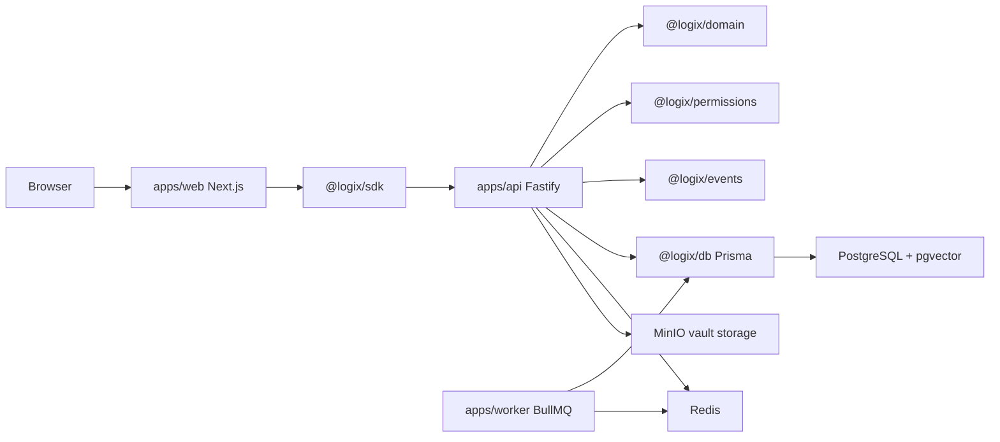

↑ [[Projects/Logix/KERNEL/docs|Docs index]]

# Architecture Overview

Logix Kernel is a TypeScript monorepo. The web app only talks to the Fastify API through `@logix/sdk`; the API owns business logic and writes through `@logix/db`; background work is isolated in `apps/worker`.

## Contracts

- API responses use `ApiOk<T>` or `ApiErr` only.
- Important mutations write domain events, audit logs, and activity feed items.
- Client actors are scoped by `actor.clientIds`; security is enforced server-side, not by hiding UI.

## Product shape

Phase 1 is a **command-center foundation**, not a generic admin dashboard. Domain pages expose operational context, activity, links, status, and workflow surfaces instead of raw table dumps.

## Related

- [[Projects/Logix/KERNEL/docs/reference/domain-model|Domain model]]
- [[Projects/Logix/KERNEL/docs/reference/permissions|Permissions]]
- [[Projects/Logix/KERNEL/docs/decisions/ADR 0004 — Web Through SDK Only|ADR 0004 — Web through SDK only]]
