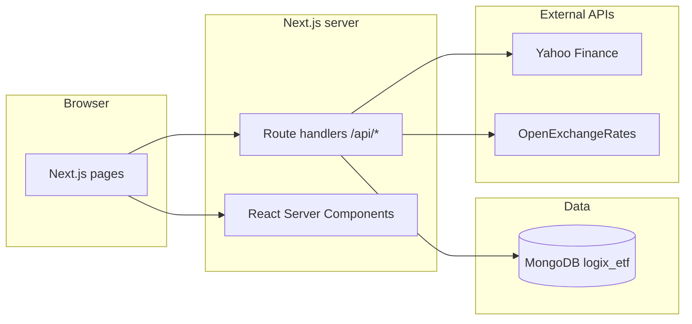

# Logix ETF

↑ [[Entities/Projects/Logix ETF|Logix ETF]]

**Logix ETF** is a private fund / ETF management web application. It tracks investor subscriptions and redemptions, underlying equity holdings, dividends, ETF-level configuration (cash reserve, dividend policy), and surfaces dashboards with NAV-style metrics, holdings valuation, and holder analytics.

The stack is a **Next.js 15** application (App Router) backed by **MongoDB** via **Mongoose**, with optional **Docker** deployment and **Traefik** routing labels for a shared reverse-proxy setup.

## Links

- [[Entities/Projects/Logix]]
- [[Entities/Projects/Logix ETF]]

---

## Table of contents

1. [Features](#features)
2. [Architecture](#architecture)
3. [Prerequisites](#prerequisites)
4. [Quick start (local)](#quick-start-local)
5. [Environment variables](#environment-variables)
6. [Database](#database)
7. [Migrations and seed data](#migrations-and-seed-data)
8. [HTTP API](#http-api)
9. [Application routes (UI)](#application-routes-ui)
10. [Business logic and data helpers](#business-logic-and-data-helpers)
11. [Market data and FX](#market-data-and-fx)
12. [Real-time prices (WebSocket)](#real-time-prices-websocket)
13. [Docker](#docker)
14. [Scripts reference](#scripts-reference)
15. [Production build](#production-build)
16. [Security notes](#security-notes)
17. [Troubleshooting](#troubleshooting)

---

## Features

- **Dashboard** — KPIs, charts, and recent activity (NAV, holdings, transactions).
- **Transactions** — Record investor **buy** / **sell** activity (amount, NAV, shares, notes) tied to investors.
- **Holdings** — Fund positions (buy/sell lots): ticker, company, shares, price, cost, optional notes.
- **Dividends** — Income by source; **distributed** flag for tracking payout vs accrual.
- **Holders** — Per-investor share totals, invested amounts, and unrealized P&amp;L vs computed NAV.
- **ETF config** — Singleton-style config: **cash reserve** and **dividend mode** (`accumulate` | `distribute`).
- **External data** — Spot quotes via Yahoo Finance chart API; USD/SAR (or related) rate via OpenExchangeRates (see [Market data and FX](#market-data-and-fx)).

---

## Architecture



- **UI** lives under `src/app/` (App Router). Some shared layout/sidebar patterns also exist under `src/components/`.
- **REST-style JSON APIs** under `src/app/api/*/route.ts` use `connectDB()` and Mongoose models in `src/lib/models/`.
- **Shared types and fetch helpers** are in `src/lib/data.ts` (including `getData()`, NAV helpers, exchange rate caching, and optional WebSocket subscription helpers).

---

## Prerequisites

- **Node.js** 22.x (aligned with the production Dockerfile base image).
- **npm** (lockfile is `package-lock.json`).
- **MongoDB** 6+ (Docker Compose uses **MongoDB 8**).

---

## Quick start (local)

1. **Clone and install**

   ```bash
   cd logix-etf-v2
   npm ci
   ```

2. **Start MongoDB** (or use [Docker](#docker) only for the database).

3. **Configure environment** — create a `.env` file in the project root (see [Environment variables](#environment-variables)).

4. **Initialize data** (optional but typical for a fresh DB):

   ```bash
   npm run migrate
   ```

5. **Run the app**

   ```bash
   npm run dev
   ```

   The dev server listens on **port 3042** (see `package.json`).

6. **Verify DB connectivity** (optional):

   ```bash
   npm run test:db
   ```

---

## Environment variables

| Variable               | Purpose                                                                                                                                                                                     |
| ---------------------- | ------------------------------------------------------------------------------------------------------------------------------------------------------------------------------------------- |
| `MONGODB_URI`          | MongoDB connection string. The app uses database name **`logix_etf`** in `connect` options (`src/lib/db.ts`), regardless of path in the URI.                                                |
| `NEXT_PUBLIC_SITE_URL` | Base URL used by server-side helpers in `getData()` and market/FX fetches when calling internal APIs (default `http://localhost:3042`). Set this in Docker/production to the public origin. |
| `NEXT_PUBLIC_WS_PORT`  | Port for the optional browser WebSocket client in `subscribeToMarketPrice()` (default **`3001`** in code). Must match your real-time quote server if you use it.                            |

**Docker Compose** also sets `NEXTAUTH_SECRET` and `AUTH_URL`. Those variables are **not consumed** by the current application code (no `next-auth` dependency); treat them as placeholders if you add authentication later.

---

## Database

Connection is centralized in `src/lib/db.ts`:

- Uses a **global singleton** cache in development to avoid exhausting connections during HMR.
- **No connection** is opened in the browser (`window` check).
- Default **database name**: `logix_etf`.

### Collections and models

| Concept     | Mongoose model | Collection notes                                                                                              |
| ----------- | -------------- | ------------------------------------------------------------------------------------------------------------- |
| Investor    | `Investor`     | `name` unique; optional `email`, `createdAt`                                                                  |
| Transaction | `Transaction`  | `investor_id` ref, `date`, `ticker`, `investor`, `type` buy/sell, `amount`, `nav`, `shares`, `notes`          |
| Holding     | `Holding`      | Fund lot: `date`, `ticker`, `company`, `action` buy/sell, `shares`, `price`, `totalCost`, `investor`, `notes` |
| Dividend    | `Dividend`     | Explicit collection `dividends`                                                                               |
| ETF config  | `ETFConfig`    | Explicit collection `etfconfigs`; `cashReserve`, `dividendMode`                                               |

Indexes are created in the migration (e.g. `date` and `ticker` / `investor` fields on transactions and holdings).

---

## Migrations and seed data

Run:

```bash
npm run migrate
```

This executes `src/lib/migrations/index.ts`, which:

1. Connects via `connectDB()`.
2. Creates default **ETFConfig** if the model is available.
3. Ensures collections exist and creates indexes.
4. Inserts **sample** investors, transactions, holdings, and dividends.

**Important:** Sample `Transaction` documents reference fixed `investor_id` values that must match the inserted investors, or inserts may fail validation. For production, replace seed data with your own migration or import pipeline.

The migration’s `down` path drops the relevant collections — use only when you intend to wipe data.

---

## HTTP API

Unless noted, responses are JSON. Errors typically return `{ "error": "..." }` with `5xx` (or `4xx` for validation).

### Transactions

| Method   | Path                     | Description                           |
| -------- | ------------------------ | ------------------------------------- |
| `GET`    | `/api/transactions`      | All transactions, newest first        |
| `POST`   | `/api/transactions`      | Create (body: fields matching schema) |
| `PUT`    | `/api/transactions/[id]` | Update                                |
| `DELETE` | `/api/transactions/[id]` | Delete                                |

### Holdings

| Method   | Path                          | Description                                                         |
| -------- | ----------------------------- | ------------------------------------------------------------------- |
| `GET`    | `/api/holdings`               | All holdings, newest first                                          |
| `POST`   | `/api/holdings`               | Create; defaults `investor` to `LOGIX INVESTMENTS GROUP` if omitted |
| `PUT`    | `/api/holdings/[ticker]/[id]` | Update                                                              |
| `DELETE` | `/api/holdings/[ticker]/[id]` | Delete                                                              |

### Dividends

| Method | Path             | Description   |
| ------ | ---------------- | ------------- |
| `GET`  | `/api/dividends` | All dividends |
| `POST` | `/api/dividends` | Create        |

### Investors

| Method | Path             | Description             |
| ------ | ---------------- | ----------------------- |
| `GET`  | `/api/investors` | List (IDs as strings)   |
| `POST` | `/api/investors` | Create; `name` required |

### ETF configuration

| Method | Path          | Description                     |
| ------ | ------------- | ------------------------------- |
| `GET`  | `/api/config` | First (or only) config document |
| `PUT`  | `/api/config` | Upsert entire config from body  |

### Market price (proxy)

| Method | Path                              | Description                                                                                                         |
| ------ | --------------------------------- | ------------------------------------------------------------------------------------------------------------------- |
| `GET`  | `/api/market-price?ticker=SYMBOL` | Latest price from Yahoo Finance chart API; on failure returns placeholder price `100` with `200` and error metadata |

### Exchange rate

| Method | Path                 | Description                                                                                              |
| ------ | -------------------- | -------------------------------------------------------------------------------------------------------- |
| `GET`  | `/api/exchange-rate` | Returns `{ rate }` (SAR from OpenExchangeRates `rates`); falls back when the upstream response is not OK |

---

## Application routes (UI)

Primary navigation (see `src/app/page.tsx` and metadata in `src/app/layout.tsx`):

| Path                              | Purpose                                           |
| --------------------------------- | ------------------------------------------------- |
| `/`                               | Home shell with sidebar; embeds dashboard content |
| `/dashboard`                      | Dashboard                                         |
| `/transactions`                   | Transaction list and filters                      |
| `/transactions/new`               | New transaction                                   |
| `/transactions/[id]/edit`         | Edit transaction                                  |
| `/holdings`                       | Holdings table                                    |
| `/holdings/new`                   | New holding                                       |
| `/holdings/[ticker]/[id]/edit`    | Edit holding                                      |
| `/holdings/[ticker]/transactions` | Transactions filtered by ticker                   |
| `/dividends`                      | Dividend list                                     |
| `/dividends/new`                  | New dividend                                      |
| `/holders`                        | Investor / holder summaries                       |
| `/holders/[id]/history`           | Holder history                                    |

The root `layout.tsx` includes commented-out top nav links to `/allocations` and `/nav-history`; those routes may not exist unless added separately.

---

## Business logic and data helpers

Key module: **`src/lib/data.ts`**

- **`getData()`** — Fetches transactions, holdings, dividends, config, and investors in parallel from the internal API base URL.
- **`calculateNAV(data)`** — Combines live quotes per holding ticker, cash reserve heuristic, undistributed dividends, and share count from transactions.
- **`getHoldingsSummary(data)`** — Aggregates lots by ticker, applies buy/sell average-cost logic, converts market value and cost to USD for reporting using **`getExchangeRate()`**.
- **`getInvestorSummary(data)`** — Running positions and invested amounts per investor; values holdings at computed NAV.
- **`getExchangeRate()`** — One-hour in-memory cache; calls `/api/exchange-rate`.
- **`subscribeToMarketPrice(ticker, callback)`** — Client-oriented WebSocket helper (see below).

Supplementary calculations for alternate dashboard-style metrics live in **`src/app/components/lib/etf-calculations.ts`** (e.g. `calculateCoreMetrics`, `calculateHolderStats`) and use slightly different field conventions (`amount_sar`, `holder_name`, etc.) — useful when integrating richer transaction types.

---

## Market data and FX

- **Equities:** `GET /api/market-price` uses Yahoo Finance’s public chart endpoint. Rate limits, availability, and terms of use are governed by Yahoo; the route is suitable for **low-volume** internal use.
- **FX:** `GET /api/exchange-rate` calls OpenExchangeRates. **Do not commit production API keys in source** — move the `app_id` to an environment variable and rotate any key that has been exposed in git history.

---

## Real-time prices (WebSocket)

`package.json` defines:

```bash
npm run ws
# and
npm run dev:all   # Next dev + ws via concurrently
```

The client helper in `src/lib/data.ts` opens `ws://localhost:${NEXT_PUBLIC_WS_PORT || "3001"}?ticker=...`.

**Docker Compose (production file)** exposes the WebSocket service on **8080** with `WS_PORT=8080`. Align `NEXT_PUBLIC_WS_PORT` in the browser environment with the port your WebSocket server actually uses.

> **Repository note:** The WebSocket entrypoint is referenced as `src/server/websocket.ts` in `package.json` and `Dockerfile.ws`. If that file is missing from your checkout, add the server implementation or adjust scripts/Dockerfile to match your deployment.

---

## Docker

### Production (`docker-compose.yml`)

Services:

- **`mongodb`** — Port `27017`, root user/password from compose env, persistent volume.
- **`app`** — Next.js **standalone** image (`Dockerfile`), port **3042**.
- **`websocket`** — Built from `Dockerfile.ws` (see note above).

Shared network: `logix-shared-network`. **Traefik** labels route `etf.dev.logix.org` to the app and WebSocket service (HTTPS entrypoints assumed on your Traefik install).

Set `MONGODB_URI` in compose to match credentials (default uses `authSource=admin`).

### Development (`docker-compose.dev.yml`)

- MongoDB plus **`app`** built from `Dockerfile.dev`, source mounted with anonymous volumes for `node_modules` and `.next`.
- Published as **host port 3003 → container 3042** (`3003:3042`).

---

## Scripts reference

| Script                            | Command           |
| --------------------------------- | ----------------- |
| Dev server (Turbopack, port 3042) | `npm run dev`     |
| Production build                  | `npm run build`   |
| Start (after build, port 3042)    | `npm start`       |
| Lint                              | `npm run lint`    |
| DB connectivity test              | `npm run test:db` |
| Run migrations                    | `npm run migrate` |
| WebSocket server                  | `npm run ws`      |
| App + WebSocket                   | `npm run dev:all` |

---

## Production build

`next.config.ts` sets `output: 'standalone'` for a minimal Node deployment (used by the main `Dockerfile`).

After `npm run build`, standalone output is consumed by the container’s `node server.js` pattern described in Next.js docs.

---

## Security notes

1. **MongoDB:** Use strong credentials and network isolation; never expose `27017` publicly without a firewall.
2. **Secrets:** Replace placeholder `NEXTAUTH_*` values if you add auth; keep `MONGODB_URI` out of client bundles (it is server-only).
3. **API keys:** External market/FX keys belong in environment variables, not in route source files.
4. **Traefik / TLS:** Labels in Compose assume an existing Traefik configuration (`secure-headers@file`, `cors-static@file`, `websecure` entrypoint).

---

## Troubleshooting

| Symptom                             | Likely cause                                                                                                               |
| ----------------------------------- | -------------------------------------------------------------------------------------------------------------------------- |
| Empty data or 500s on first load    | Mongo empty or `MONGODB_URI` wrong; run `npm run migrate` or verify connection string and DB name `logix_etf`.             |
| `getData()` fails in server context | `NEXT_PUBLIC_SITE_URL` must be reachable from the Next server (use `http://127.0.0.1:3042` or the service name in Docker). |
| NAV or holdings look wrong          | Mixed USD/SAR handling: check `getExchangeRate()` and ticker suffix heuristics (e.g. `.SR` for SAR).                       |
| WebSocket never connects            | Server not running, or `NEXT_PUBLIC_WS_PORT` mismatch; confirm `src/server/websocket.ts` exists if using `npm run ws`.     |
| Migration insert errors             | Sample `investor_id` / investor set out of sync; clear DB or fix seed IDs.                                                 |

---

## Project layout (concise)

```
src/
  app/                 # App Router: pages, layouts, API routes, feature components
  components/          # Shared UI (e.g. sidebar primitives, legacy Layout)
  lib/
    db.ts              # Mongo connection
    data.ts            # Fetch helpers, NAV, summaries, FX, WS client helper
    models/            # Mongoose schemas
    migrations/        # Seed migration runner
```

---

## License and contributions

This repository is marked **private** in `package.json`. Add your organization’s license and contribution guidelines when you open-source or distribute the project.
