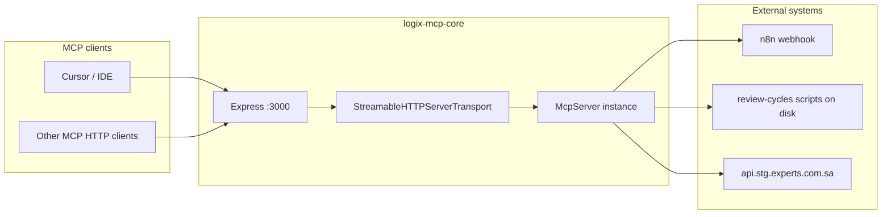

# Logix MCP Core

↑ [[Entities/Projects/Logix MCP Core|Logix MCP Core]]

**Logix MCP Core** is a [Model Context Protocol (MCP)](https://modelcontextprotocol.io/) server that exposes tools and prompts to AI clients over **HTTP** (Streamable HTTP transport). It integrates with **n8n** webhooks and can run **TaskMaster / review-cycle** automation scripts inside a configurable project directory—typically used alongside the Experts LMS monorepo and internal reporting workflows.

## Links

- [[Entities/Projects/Logix]]
- [[Entities/Projects/Logix MCP Core]]
- [[Projects/Logix/MCP_CORE/MCP CORE|MCP Core README]]

---

## Table of contents

|                  |                                         |
| ---------------- | --------------------------------------- |
| **Package**      | `@logix/mcp`                            |
| **Runtime**      | Node.js 24+ (see `Dockerfile`)          |
| **Framework**    | Express 5 + `@modelcontextprotocol/sdk` |
| **Default port** | `3000`                                  |

1. [What this server does](#what-this-server-does)
2. [Architecture](#architecture)
3. [Prerequisites](#prerequisites)
4. [Quick start (local)](#quick-start-local)
5. [Docker and Compose](#docker-and-compose)
6. [Environment variables](#environment-variables)
7. [HTTP API and MCP sessions](#http-api-and-mcp-sessions)
8. [Tools reference](#tools-reference)
9. [Prompts](#prompts)
10. [Project layout and build](#project-layout-and-build)
11. [Operations and troubleshooting](#operations-and-troubleshooting)
12. [Security notes](#security-notes)
13. [Extending the server](#extending-the-server)

---

## What this server does

- Accepts MCP connections on **`/sse`** using the SDK’s **`StreamableHTTPServerTransport`** (despite the path name, the implementation follows the streamable HTTP pattern used in current MCP SDK examples).
- Registers **tools** that:
  - Echo / ping for smoke tests.
  - POST JSON to an **n8n webhook**.
  - Run shell-backed Node scripts under **`$PROJECT_ROOT/.taskmaster/review-cycles/`** (client reports, cycles, orchestrator, complexity sync, recent activity).
  - Call a **staging health** endpoint for the Experts API.
- Registers a simple **`echo`** **prompt** for templated user messages.

The server is **session-aware**: each new MCP initialize request creates a transport with a generated session id; subsequent requests must send that id in a header.

---

## Architecture



**Lifecycle (simplified):**

1. Client sends an MCP **initialize** request via **POST** `/sse` (no `mcp-session-id` yet).
2. Server creates a transport, assigns a **session id**, and stores the transport in memory.
3. Client includes **`mcp-session-id`** on later **POST**, **GET**, and **DELETE** calls for that session.
4. **GET** `/sse` is used for server-to-client notifications (SSE).
5. **DELETE** `/sse` terminates the session; the transport is removed on close.

---

## Prerequisites

- **Node.js** compatible with the repo (Docker uses **Node 24**).
- **npm** (lockfile is optional in Docker build; local dev typically uses `npm install`).
- For **full tool functionality**, a clone of the **Experts** (or compatible) app mounted or copied so that **`PROJECT_ROOT`** contains `.taskmaster/review-cycles/` with the expected scripts (`smart-client-reporter.js`, `automation-orchestrator.js`, etc.).
- For **Docker Compose** as shipped: an **external** Docker network **`logix-shared-network`** (for Traefik and sibling services).

---

## Quick start (local)

```bash
cd /path/to/mcp-core
npm install
npm run build
npm run dev:all
```

- **`dev:all`** runs **`tsc --watch`** and **`nodemon build/index.js`** together so TypeScript recompiles and the server restarts on changes.
- The process listens on **port 3000** (hardcoded in `src/index.ts`).

**Alternative (build once + run server only):**

```bash
npm run build
node build/index.js
```

---

## Docker and Compose

### Image build

The `Dockerfile`:

- Uses **`node:24.11.1-bullseye-slim`**
- Installs utilities: `dumb-init`, `bash`, `curl`, `nano`, `jq`
- Runs **`npm install`**, **`npm run build`**, exposes **3000**
- Default **`CMD`** is **`npm run dev:all`** (watch + nodemon—suitable for dev images)

An **`entrypoint.sh`** is included for custom commands (e.g. `docker run ... ./entrypoint.sh node build/index.js`). The default image command does not invoke it unless you override the container command.

### `docker-compose.yml` (reference)

The provided Compose file:

- Builds/tags image **`loogix/logix-mcp:dev`**
- Publishes **`3000:3000`**
- Mounts the **project** into **`/app`** for live code
- Persists **`/home/node/.mcp`** in volume **`mcp_data`**
- Attaches **Traefik** labels for host **`mcp.dev.logi-x.org`**, TLS, and middleware **`secure-headers@file`**
- Connects to **`logix-shared-network`** (**`external: true`**)

Before `docker compose up`, create the network if needed:

```bash
docker network create logix-shared-network
```

Uncomment and adjust volume mounts (e.g. Experts repo) if tools must run scripts outside the container copy of `mcp-core`.

---

## Environment variables

| Variable              | Purpose                                         | Default in code                                              |
| --------------------- | ----------------------------------------------- | ------------------------------------------------------------ |
| **`N8N_WEBHOOK_URL`** | URL for **`trigger_n8n_webhook`**               | `https://n8n.dev.logi-x.org/webhook/trigger-n8n-report-prod` |
| **`PROJECT_ROOT`**    | Root directory for `cd ... &&` script execution | `/var/www/html/experts`                                      |

Optional Compose/runtime variables (not read by the app directly but common in deployments):

- **`GENERIC_TIMEZONE`**, **`TZ`** — set in `docker-compose.yml` example (`Asia/Riyadh`).

> **Note:** `dotenv` is a dependency but **`src/index.ts` does not call `config()`**; export variables in the shell, Compose `environment:` block, or your process manager.

---

## HTTP API and MCP sessions

| Method     | Path   | Headers                                           | Body / behavior                                                                   |
| ---------- | ------ | ------------------------------------------------- | --------------------------------------------------------------------------------- |
| **POST**   | `/sse` | Optional `mcp-session-id` for continuing sessions | MCP JSON-RPC body; without session id, must be an **initialize** request to start |
| **GET**    | `/sse` | **Required** `mcp-session-id`                     | SSE stream for notifications                                                      |
| **DELETE** | `/sse` | **Required** `mcp-session-id`                     | Session teardown                                                                  |

**Errors:**

- Invalid POST (e.g. missing session for non-initialize): **400** with JSON-RPC error **`Bad Request: No valid session ID provided`**
- Invalid/missing session on GET/DELETE: **400** text **`Invalid or missing session ID`**

**DNS rebinding:** The SDK transport allows disabling DNS rebinding protection for compatibility. For local-only hardening, see the commented options in `src/index.ts` (`enableDnsRebindingProtection`, `allowedHosts`).

---

## Tools reference

All tools are registered on the **`McpServer`** named **`n8n-webhook`** (version **`1.0.0`**). Inputs are validated with **Zod** schemas.

### `ping`

|             |                              |
| ----------- | ---------------------------- |
| **Purpose** | Smoke test: echoes a string. |
| **Input**   | `message` (string)           |
| **Output**  | Text: `Tool echo: …`         |

### `trigger_n8n_webhook`

|             |                                                                                           |
| ----------- | ----------------------------------------------------------------------------------------- |
| **Purpose** | POST a JSON payload to **`N8N_WEBHOOK_URL`**.                                             |
| **Input**   | `payload` (string) — **JSON-serializable object as a string**; parsed with `JSON.parse`.  |
| **Output**  | Success text from response `message` or a default success string; on failure, error text. |
| **HTTP**    | Uses `fetch`, `User-Agent: n8n-webhook-mcp/1.0`, `Content-Type: application/json`.        |

### `run_enhanced_client_report` (LEGACY)

|             |                                                                                 |
| ----------- | ------------------------------------------------------------------------------- |
| **Purpose** | Runs `enhanced-client-report.js` under `.taskmaster/review-cycles`.             |
| **Input**   | `test_mode` (string, default `"true"`) — when truthy, prepends `NODE_ENV=test`. |
| **Note**    | Prefer **`run_smart_client_report`**.                                           |

### `run_cycle`

|             |                                                                               |
| ----------- | ----------------------------------------------------------------------------- |
| **Purpose** | Runs `run-cycle.sh` with a cycle type argument.                               |
| **Input**   | `cycle_type` (string, default `"client"`) — e.g. `client`, `daily`, `weekly`. |

### `run_automation_orchestrator`

|             |                                                                                |
| ----------- | ------------------------------------------------------------------------------ |
| **Purpose** | Runs `automation-orchestrator.js` with an action argument.                     |
| **Input**   | `action` (string, default `"status"`), `test_mode` (string, default `"true"`). |
| **Actions** | e.g. `client`, `daily`, `weekly`, `status` (see tool description in server).   |

### `run_smart_client_report` (recommended)

|             |                                                                                                                        |
| ----------- | ---------------------------------------------------------------------------------------------------------------------- |
| **Purpose** | Runs `smart-client-reporter.js` with recent activity and Slack-oriented output options.                                |
| **Input**   | `test_mode` (string, default `"true"`), `output_format` (string, default `"summary"`) — `json`, `slack`, or `summary`. |

### `run_recent_activity_tracker`

|             |                                                                                                                |
| ----------- | -------------------------------------------------------------------------------------------------------------- |
| **Purpose** | Runs `recent-activity-tracker.js` to summarize work from TaskMaster `<info added>` blocks.                     |
| **Input**   | `hours_back` (string, default `"48"`), `format` (string, default `"summary"`) — `json`, `slack`, or `summary`. |

### `sync_complexity_reports`

|              |                                                                                               |
| ------------ | --------------------------------------------------------------------------------------------- |
| **Purpose**  | Runs `sync-complexity-reports.js` with optional env toggles.                                  |
| **Input**    | `force_refresh`, `specific_tags`, `cleanup_old` (strings with defaults documented in schema). |
| **Behavior** | Builds a shell command with `FORCE_REFRESH`, `SPECIFIC_TAGS`, `SKIP_CLEANUP` as appropriate.  |

### `server_health`

|             |                                                                                           |
| ----------- | ----------------------------------------------------------------------------------------- |
| **Purpose** | Fetches **`https://api.stg.experts.com.sa/v1/health`** and returns JSON (pretty-printed). |
| **Input**   | None                                                                                      |

---

## Prompts

### `echo`

|             |                                                                                      |
| ----------- | ------------------------------------------------------------------------------------ |
| **Purpose** | Wraps user text in a single user message for downstream processing.                  |
| **Args**    | `message` (string)                                                                   |
| **Output**  | MCP messages array with role `user` and instruction to process commands in sequence. |

---

## Project layout and build

| Path                 | Role                                                   |
| -------------------- | ------------------------------------------------------ |
| `src/index.ts`       | Express app, transport map, MCP server, tools, prompts |
| `build/`             | Compiled JS output (`tsc` → `outDir`)                  |
| `package.json`       | Scripts and dependencies                               |
| `tsconfig.json`      | `strict` TypeScript, ES2022, `Node16` modules          |
| `Dockerfile`         | Production-oriented base image; dev-style **`CMD`**    |
| `docker-compose.yml` | Dev-oriented Compose with Traefik labels               |
| `entrypoint.sh`      | Optional wrapper to run a custom command               |

**Scripts (from `package.json`):**

| Script               | Description                       |
| -------------------- | --------------------------------- |
| `npm run build`      | `tsc` + chmod on `build/index.js` |
| `npm run server:dev` | `nodemon build/index.js`          |
| `npm run mcp:dev`    | `tsc --watch`                     |
| `npm run dev:all`    | Concurrent watch + nodemon        |
| `npm run typecheck`  | `tsc --noEmit`                    |

---

## Operations and troubleshooting

- **Port already in use:** Another process may be bound to **3000**; stop it or change the listen port in code (currently fixed at `app.listen(3000)`).
- **Tools fail with path errors:** Ensure **`PROJECT_ROOT`** points at a tree that contains **`.taskmaster/review-cycles/`** and the expected `.js` / `.sh` files. In Docker, mount that repo if it is not inside the image.
- **n8n webhook failures:** Check **`N8N_WEBHOOK_URL`**, network egress from the container, and n8n workflow auth expectations.
- **Session errors:** Clients must send **`mcp-session-id`** after initialize on GET/DELETE and on subsequent POSTs for the same session.
- **Memory / stale sessions:** Transports live in an in-memory map; restarting the process clears all sessions.

---

## Security notes

- **Command execution:** Several tools run **`exec`** with `cd ${PROJECT_ROOT} && …`. Treat **`PROJECT_ROOT`** and who can call the MCP server as a **trust boundary**. Only expose this service to authenticated networks or trusted clients.
- **Webhook URL:** Defaults to an internal URL; override in production and protect n8n endpoints.
- **Health endpoint:** Hardcoded staging URL; change if you must avoid calling external environments from your network.
- **Traefik / TLS:** Compose example enables TLS and middleware; align **`certResolver`** and host rules with your infrastructure.

---

## Extending the server

1. Add **`server.registerTool`** or **`server.registerPrompt`** blocks inside the **new session** branch (where `McpServer` is constructed), before **`server.connect(transport)`**.
2. Use **Zod** `inputSchema` / `argsSchema` for clear client-side validation.
3. Prefer small, testable helpers (similar to **`triggerN8nWebhook`** and **`runReviewCycleCommand`**).
4. Run **`npm run typecheck`** and **`npm run build`** before committing.

---

## License

**MIT** — see `package.json` `license` field.

## Author

Ahmed Sulaimani — [GitHub @xcode-it](https://github.com/xcode-it), `admin@logi-x.org`.
