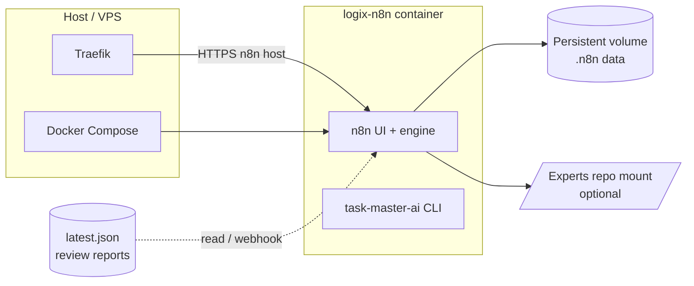

# n8n-core — Project documentation

↑ [[Entities/Projects/Logix N8N Core|Logix N8N Core]]

This repository holds the **custom n8n image**, **Compose stack**, **exported workflows**, **prompt modules**, and **helper scripts** used to turn Taskmaster / Experts review-cycle data into client-facing updates (Slack Block Kit, HTML email, and related automation).

## Links

- [[Entities/Projects/Logix]]

---

## Table of contents

|                  |                                         |
| ---------------- | --------------------------------------- |
| **Package**      | `@logix/n8n`                            |
| **Runtime**      | Node.js 24+ (see `Dockerfile`)          |
| **Framework**    | Express 5 + `@modelcontextprotocol/sdk` |
| **Default port** | `3000`                                  |

1. [What this project is](#1-what-this-project-is)
2. [Architecture at a glance](#2-architecture-at-a-glance)
3. [Repository layout](#3-repository-layout)
4. [Prerequisites](#4-prerequisites)
5. [Configuration](#5-configuration)
6. [Build and run](#6-build-and-run)
7. [Workflows and data flow](#7-workflows-and-data-flow)
8. [Prompts and AI behavior](#8-prompts-and-ai-behavior)
9. [Utility scripts (`.n8n/*.js`)](#9-utility-scripts-n8njs)
10. [Versioned exports and backups](#10-versioned-exports-and-backups)
11. [Security and secrets](#11-security-and-secrets)
12. [Operations checklist](#12-operations-checklist)
13. [Troubleshooting](#13-troubleshooting)
14. [Further reading inside the repo](#14-further-reading-inside-the-repo)

---

## 1. What this project is

| Layer                 | Role                                                                                                                                                           |
| --------------------- | -------------------------------------------------------------------------------------------------------------------------------------------------------------- |
| **Container**         | Extends `n8nio/n8n:latest` with shell tooling and global `task-master-ai` for in-container automation aligned with the Experts/Taskmaster stack.               |
| **Orchestration**     | `docker-compose.yml` defines the n8n service, port mapping, timezone, public URL, Traefik labels, and volume mounts.                                           |
| **Workflows**         | JSON exports (`nodes-prod*.json`, workflows under `.n8n/`) describe nodes for reading reports, analyzing deltas, AI summarization, Slack, Mailtrap email, etc. |
| **Content / prompts** | JSON and Markdown prompt modules, plus step-by-step guides for evolving workflows (multi-message Slack, migration from legacy data sources).                   |
| **Fixtures**          | Sample task/report JSON (`tasksData.json`, `domains.json`, `ai-res.json`) for testing shape and copy without hitting production.                               |

This repo is **not** the Experts application itself; it integrates with paths and reports that live alongside it (see [§7](#7-workflows-and-data-flow)).

---

## 2. Architecture at a glance



- **Ingress**: Traefik terminates TLS and routes by host rule to the n8n container port (internal `5678`, published as `5679:5678` in the sample Compose file).
- **State**: n8n’s home directory (workflows, credentials metadata, execution history) should live on a **persistent volume**; the Compose file bind-mounts a host path for that purpose.
- **Upstream data**: Workflows expect enriched client reports (for example `messageGeneration`, `recentActivity`) produced by the review-cycle / reporter pipeline; see internal guides under `.n8n/`.

---

## 3. Repository layout

| Path                                            | Description                                                                                          |
| ----------------------------------------------- | ---------------------------------------------------------------------------------------------------- |
| `Dockerfile`                                    | From `n8nio/n8n:latest`; installs `bash`, `curl`, `git`, `sudo`, and global `task-master-ai`.        |
| `docker-compose.yml`                            | Service `logix-n8n`, env vars, Traefik labels, networks, volume mounts.                              |
| `init.sh`                                       | Optional entry helper: ensures `task-master` is on PATH, then `exec`’s the real command.             |
| `nodes-prod.json`, `nodes-prod-*-latest.json`   | Exported workflow snapshots (dated filenames = backups / drift tracking).                            |
| `tasksData.json`, `domains.json`, `ai-res.json` | Sample or auxiliary JSON for domains, tasks, or AI fixtures.                                         |
| `.n8n/`                                         | **Primary knowledge base**: workflow JSON, prompt JSON/MD, merge/debug guides, one-off JS utilities. |
| `.n8n-07-12-2025/`                              | Dated archive of workflow fragments / validators from a prior change window.                         |
| `.vscode/`                                      | Editor settings for contributors (optional).                                                         |
| `Summarize with OpenAI1.prompt`                 | Standalone prompt artifact (legacy / reference).                                                     |

> **Note:** Paths like `/home/logix/experts` and `/opt/volumes/n8n_core_data` inside `docker-compose.yml` are **environment-specific**. Adjust them when you clone this repo to another machine or organization.

---

## 4. Prerequisites

- Docker and Docker Compose v2
- An external Docker **network** used by Traefik (in this stack: `logix-shared-network` marked `external: true`)
- (Production) Traefik with TLS cert resolver and any middleware referenced by labels (e.g. `secure-headers@file`)
- Optional: access to the Experts monorepo and Taskmaster report output if you run file-based triggers

---

## 5. Configuration

### 5.1 Environment variables (Compose)

The Compose file sets (among others):

| Variable                                | Purpose                                                  |
| --------------------------------------- | -------------------------------------------------------- |
| `GENERIC_TIMEZONE`, `TZ`                | Scheduler and display timezone (example: `Asia/Riyadh`). |
| `N8N_PORT`                              | Port n8n listens on **inside** the container.            |
| `N8N_HOST`, `N8N_PROTOCOL`              | How n8n advertises itself.                               |
| `WEBHOOK_URL`, `N8N_EDITOR_BASE_URL`    | Public URL for webhooks and editor links.                |
| `N8N_ENFORCE_SETTINGS_FILE_PERMISSIONS` | Hardening for settings files.                            |
| `N8N_RUNNERS_ENABLED`                   | Task runners feature flag as used in this deployment.    |

Add API keys and provider secrets via n8n’s **Credentials** UI or your preferred secret mechanism; do not commit real secrets into workflow JSON in Git.

### 5.2 Volumes

- **n8n data**: Should map to a durable directory (encrypted backup recommended).
- **Experts mount**: Optional bind mount so Code nodes or file triggers can read `.taskmaster/reports/...` from the host.

### 5.3 Traefik labels

Labels declare the host rule, entrypoint, TLS resolver name, middleware, and upstream port. If you change hostname or cert resolver, update labels and DNS together.

---

## 6. Build and run

From the repository root:

```bash
# Build local image tags declared in compose
docker compose build

# Start in foreground (logs)
docker compose up

# Or detached
docker compose up -d
```

First-time setup on a new server:

1. Create the external network Traefik expects (name must match `docker-compose.yml`).
2. Ensure the host directory for n8n data exists and is writable by the container user if needed.
3. Point DNS and Traefik to the new host.
4. Open the n8n UI, complete setup, and import or activate workflows.

To use a different public URL, change env vars and Traefik `Host(...)` rule in sync.

---

## 7. Workflows and data flow

### 7.1 Typical “client update” pipeline

A representative flow (names vary by export):

1. **Trigger** — Schedule (e.g. daily) or webhook.
2. **Read report** — Load `latest.json` (or receive JSON via webhook) from the Taskmaster / Experts review cycle.
3. **Process Data** — Normalize fields for downstream nodes.
4. **Analyze Changes** — Compare with **Google Sheets** (or similar) stored “previous state” to compute progress deltas and narrative context.
5. **AI Summarization** — OpenAI (or compatible) node using modular prompts; may output a single message or **JSON with multiple Slack messages**.
6. **Delivery** — Slack (Block Kit), Mailtrap email, or both; multi-message paths use **Extract → Loop → Wait** between Slack posts.

Detailed node-by-node instructions for the multi-message upgrade live in [[Projects/Logix/N8N_CORE/docs/SIMPLE_UPDATE_GUIDE|SIMPLE_UPDATE_GUIDE]] and [[Projects/Logix/N8N_CORE/docs/README|.n8n README]].

### 7.2 Enhanced report shape (multi-message)

Downstream AI nodes may expect structures such as:

- `messageGeneration.messageCount` — How many Slack messages to produce.
- `messageGeneration.instructions` — Per-message type and length limits.
- `recentActivity.hasActivity` / `recentActivity.activities` — Recent work for “what we built” style updates.

If your reporter does not emit these keys, either extend the reporter or simplify the prompts to single-message mode.

### 7.3 Importing workflows

- Prefer **manual replication** (copy-paste nodes and prompts) when n8n version skew makes full JSON import brittle; the internal docs recommend this for critical paths.
- Full JSON import is fine when source and target n8n versions and community nodes match.

---

## 8. Prompts and AI behavior

| Artifact                                             | Role                                                        |
| ---------------------------------------------------- | ----------------------------------------------------------- |
| `.n8n/system-prompt.json`                            | System instructions (role, tone, output rules).             |
| `.n8n/user-prompt.json`                              | User template with n8n expressions referencing prior nodes. |
| `.n8n/ai-prompts-config.json`                        | Aggregated configuration.                                   |
| `.n8n/PROMPT_MODULES_GUIDE.md`                       | How modules are wired and customized.                       |
| `.n8n/ai-system-prompt.md`, `.n8n/ai-user-prompt.md` | Human-editable prompt sources.                              |

Customization pattern:

- Adjust **tone and format** in the system prompt.
- Adjust **which data sections appear** in the user prompt template.
- Keep n8n expression syntax valid (`{{ $('Node Name').item.json... }}`) after renames.

For **strict JSON output** (multi-message Slack), the SIMPLE update guide’s prompts require the model to return `{ "messages": [ { "blocks": [...] }, ... ] }` only—plain text breaks the Extract node unless a fallback is implemented.

---

## 9. Utility scripts (`.n8n/*.js`)

These files support development and debugging; paste into **Code** nodes or run locally with fixture data as appropriate:

| Script (examples)                                   | Purpose                                               |
| --------------------------------------------------- | ----------------------------------------------------- |
| `analyze-changes.js`                                | Progress / history delta logic consumed by workflows. |
| `analyze-changes-DEBUG.js`                          | Verbose logging variant for miswired inputs.          |
| `extract-slack-markdown*.js`, `merge-messages-*.js` | Slack text / Block Kit merging experiments.           |
| `VALIDATE_AI_OUTPUT_NODE.js`                        | Guardrails for AI JSON shape.                         |
| `process-data.js`, `compress.js`                    | Data shaping helpers.                                 |

See [[Projects/Logix/N8N_CORE/docs/DEBUGGING_GUIDE|DEBUGGING_GUIDE]] for the analyze-changes debug workflow.

---

## 10. Versioned exports and backups

- **`nodes-prod.json`** — Baseline export.
- **`nodes-prod-01-11-2025-latest.json`**, **`nodes-prod-03-12-2025-latest.json`** — Time-stamped snapshots for rollback and diffing.

**Practice:** Before large workflow edits, export from n8n UI and commit with a dated filename or store in object storage. Keep parity between:

- Workflow JSON in Git- Live n8n database on the server volume

---

## 11. Security and secrets

- **Never commit** live API keys, OAuth tokens, or webhook secrets. Rotate anything that has appeared in historical exports.
- Workflow exports often contain **credential IDs**, channel IDs, and **PII** (e.g. stakeholder emails in Code nodes). Treat JSON exports as confidential; redact before sharing externally.
- Restrict volume backups and repo access; n8n credentials are encrypted with instance keys—protect those files.
- Use Traefik / network policies so the n8n UI is not exposed without authentication appropriate to your threat model.

---

## 12. Operations checklist

- [ ] External Docker network exists and matches Compose.
- [ ] Persistent volume for `/home/node/.n8n` (or your chosen path) is backed up.
- [ ] DNS + TLS + `WEBHOOK_URL` / `N8N_EDITOR_BASE_URL` aligned.
- [ ] Community nodes (e.g. Mailtrap) installed in image or via n8n UI as required by exports.
- [ ] Google Sheets + Slack + OpenAI credentials valid; test executions on a staging channel.
- [ ] Review cycle produces `latest.json` on schedule if using file triggers.
- [ ] Multi-message Slack path tested (loop + wait + Block Kit size limits).

---

## 13. Troubleshooting

| Symptom                             | Likely cause                            | What to check                                                                            |
| ----------------------------------- | --------------------------------------- | ---------------------------------------------------------------------------------------- |
| Webhooks 404 or wrong URL           | `WEBHOOK_URL` / reverse proxy path      | Env vars, Traefik router priority, n8n “Test URL” vs production URL.                     |
| AI returns prose instead of JSON    | Prompt drift or wrong model             | Restore prompts from `.n8n/SIMPLE_UPDATE_GUIDE.md`; add validation node.                 |
| `Analyze Changes` shows wild deltas | Wrong input node or schema change       | Use `analyze-changes-DEBUG.js`; compare `Process Data` output keys.                      |
| Slack blocks fail                   | Invalid Block Kit or stringified blocks | Ensure expression `JSON.stringify($json.blocks)` where required; validate length limits. |
| Timezone off by hours               | TZ vs cron                              | `GENERIC_TIMEZONE`, container TZ, and workflow schedule.                                 |

For migration from legacy `tasks.json`-only flows to enriched reports, see [[Projects/Logix/N8N_CORE/docs/MIGRATION_GUIDE|MIGRATION_GUIDE]].

---

## 14. Further reading inside the repo

| Document                                                    | Topic                                                                    |
| ----------------------------------------------------------- | ------------------------------------------------------------------------ | ------------------------------------------------------------- | -------------------------------------- |
| [[Projects/Logix/N8N_CORE/docs/README                       | n8n/README]]                                                            | Multi-message package overview, data flow, checklist.         |
| [[Projects/Logix/N8N_CORE/docs/SIMPLE_UPDATE_GUIDE          | n8n/SIMPLE_UPDATE_GUIDE]]                                               | Copy-paste UI steps for Slack multi-message upgrade.          |
| [[Projects/Logix/N8N_CORE/docs/MIGRATION_GUIDE              | n8n/MIGRATION_GUIDE]]                                                   | Taskmaster review-cycle integration, file vs webhook sources. |
| [[Projects/Logix/N8N_CORE/docs/PROMPT_MODULES_GUIDE         | n8n/PROMPT_MODULES_GUIDE]]                                              | Modular prompts and customization.                            |
| [[Projects/Logix/N8N_CORE/docs/DEBUGGING_GUIDE              | n8n/DEBUGGING_GUIDE]]                                                   | Analyze-changes debugging.                                    |
| [[Projects/Logix/N8N_CORE/docs/SLACK_NODE_CONFIG            | n8n/SLACK_NODE_CONFIG]], [[Projects/Logix/N8N_CORE/docs/SLACK_FIX       | n8n/SLACK_FIX]]                                              | Slack-specific fixes.                  |
| [[Projects/Logix/N8N_CORE/docs/MERGE_GUIDE                  | n8n/MERGE_GUIDE]], [[Projects/Logix/N8N_CORE/docs/ENSURE_CORRECT_FORMAT | n8n/ENSURE_CORRECT_FORMAT]]                                  | Workflow merge and format constraints. |
| [[Projects/Logix/N8N_CORE/n8n-07-12-2025/AI_WORKFLOW_GUIDE | n8n-07-12-2025/AI_WORKFLOW_GUIDE]]                                      | Archived workflow notes for that date.                        |

---

## Document history

This guide was generated to unify **runtime** (Docker/Traefik), **workflow/prompt** assets under `.n8n/`, and **operational** practices. Update it when hostnames, volume paths, or the canonical workflow names change.
