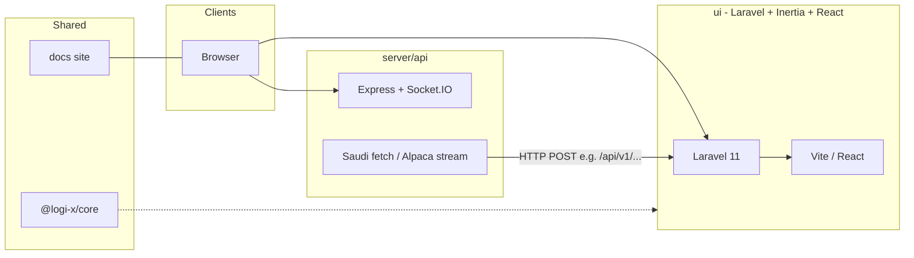

# Sulaimani Holdings Ltd — Monorepo

↑ [[Entities/Projects/Sulaimani Holdings|Sulaimani Holdings]]

Private monorepo for **Sulaimani Holdings Ltd**: a portfolio and markets-oriented web application backed by Laravel, a Node market-data service, a shared UI kit, internal docs, and an optional AI / Open WebUI–based workspace.

## Links

- [[Entities/Projects/Sulaimani Holdings]]
- [[Entities/Projects/Logix]]

**Package manager:** [Yarn 4](https://yarnpkg.com/) (Berry), `nodeLinker: node-modules` (see `.yarnrc.yml`).

**License:** MIT (root `package.json`).

---

## Table of contents

1. [Architecture](#architecture)
2. [Repository layout](#repository-layout)
3. [Prerequisites](#prerequisites)
4. [First-time setup](#first-time-setup)
5. [Running services](#running-services)
6. [Workspace reference](#workspace-reference)
7. [Main application (`ui`)](#main-application-ui)
8. [Market data API (`server/api`)](#market-data-api-serverapi)
9. [Design system (`@logi-x/core`)](#design-system-logi-xcore)
10. [Documentation site (`docs`)](#documentation-site-docs)
11. [AI workspace (`ai`)](#ai-workspace-ai)
12. [Quality, formatting, and Git hooks](#quality-formatting-and-git-hooks)
13. [Configuration and secrets](#configuration-and-secrets)
14. [Troubleshooting](#troubleshooting)
15. [Further reading](#further-reading)

---

## Architecture

At a high level, the system is split into:

- **Browser clients** — React pages served through **Laravel + Inertia** (`ui`), consuming REST APIs and real-time features (Reverb, queues, Pulse).
- **Supporting Node service** — **`server/api`**: Express + Socket.IO, optional schedulers for **Saudi Exchange** scraping and **Alpaca** streaming, posting into the Laravel API.
- **Shared frontend library** — **`packages/@logi-x/logix-core`** (npm name `@logi-x/core`) consumed by apps that need the Logi-X component set.
- **Standalone docs** — Vite + React site in **`docs`**.
- **AI stack** — **`ai`**: SvelteKit frontend plus Python/Open WebUI-style backend (see `ai/README.md` for upstream-oriented docs).



---

## Repository layout

| Path                           | Yarn workspace | Role                                                                       |
| ------------------------------ | -------------- | -------------------------------------------------------------------------- |
| `ui/`                          | `ui`           | Main Laravel 11 app: Inertia + React, Vite, Sanctum, Reverb, Pulse, queues |
| `server/api/`                  | `api`          | Express API + Socket.IO; market data integrations                          |
| `packages/@logi-x/logix-core/` | `@logi-x/core` | Publishable UI/component library (TypeScript, Tailwind, Storybook)         |
| `docs/`                        | `docs`         | Internal documentation / marketing-style site (Vite + React)               |
| `ai/`                          | `ai`           | SvelteKit app + Python backend (Open WebUI lineage)                        |

Root `package.json` defines workspaces and orchestration scripts (e.g. `yarn all`).

---

## Prerequisites

| Tool                 | Notes                                                                                                          |
| -------------------- | -------------------------------------------------------------------------------------------------------------- |
| **Node.js**          | Root engines: `>=16`; `@logi-x/core` prefers `>=18`. Use **Node 18+** for all workspaces.                      |
| **Yarn**             | **4.x** (see `packageManager` in root `package.json`). Enable via Corepack: `corepack enable` then use `yarn`. |
| **PHP**              | **8.1+** (Laravel 11 ecosystem in `ui/composer.lock`).                                                         |
| **Composer**         | For `ui` PHP dependencies.                                                                                     |
| **Database / Redis** | As required by your `ui/.env` (MySQL/PostgreSQL/SQLite, Redis for cache/queue if configured).                  |
| **Python / Conda**   | Only for **`ai`** backend scripts (e.g. conda env `ai3` referenced in `ai/backend/start.sh`).                  |

---

## First-time setup

From the repository root:

```bash
# Install all workspace dependencies
yarn install

# PHP dependencies for the main app
yarn ui:install
# or: cd ui && composer install
```

**Laravel environment (`ui`):**

- Copy or create `ui/.env` from your team’s template (Laravel expects `APP_KEY`, `DB_*`, `QUEUE_*`, Reverb settings, etc.).
- Run migrations and seeders as your project requires:

  ```bash
  cd ui && php artisan migrate
  ```

**Storage link (if you serve uploads locally):**

```bash
yarn ui:link
```

---

## Running services

### Run everything defined at the root (UI + docs + IO + API)

```bash
yarn all
```

This uses `concurrently` to start:

- `yarn ui:wsl` — UI dev-related processes (see [Main application](#main-application-ui))
- `yarn docs:dev`
- `yarn io:dev` — `@logi-x/core` dev pipeline
- `yarn api:dev` — `server/api` with nodemon

### Individual entrypoints (from repo root)

| Goal                              | Command                       |
| --------------------------------- | ----------------------------- |
| UI only (WSL-oriented script set) | `yarn ui:wsl`                 |
| UI with SSL-oriented stack        | `yarn ui:ssl`                 |
| API server                        | `yarn api:dev`                |
| Logi-X core dev                   | `yarn io:dev`                 |
| Docs dev server                   | `yarn docs:dev`               |
| AI (WebUI + backend bash)         | `yarn ai:models` or `yarn ai` |

**Note:** Several scripts use **custom hosts** (e.g. `sulaimani-holdings-ltd.gobeyound.com`, `docs.gobeyound.com`). Add matching entries to `/etc/hosts` or adjust scripts for local development.

---

## Workspace reference

### Main application (`ui`)

- **Stack:** Laravel **11**, **Inertia.js** + **React 18**, **Vite 5**, **Tailwind**, **NextUI**, **Sanctum**, **Laravel Reverb**, **Pulse**, **Ziggy**.
- **Market / finance libraries:** e.g. `@polygon.io/client-js`, Chart.js, ApexCharts, Plotly, D3.

**Typical dev (full stack inside `ui`):**

```bash
cd ui && yarn all
```

That starts (via `concurrently`): `php artisan serve`, Vite, Reverb, Pulse worker, queue listener, scheduler worker, and the `api` workspace dev server.

**Lighter options** (see `ui/package.json`):

- `yarn ns` — server + Vite only
- `yarn wo-api` — full UI stack without the nested `api:dev`
- `yarn wsl` — dev + socket + pulse + queue (no `artisan serve`; useful when PHP is hosted elsewhere)

**Build for production:**

```bash
cd ui && yarn build
```

**Notable HTTP areas** (see `ui/routes/web.php`, `ui/routes/api.php`):

- **Public:** welcome (`/`), Breeze auth under `routes/auth.php`.
- **Authenticated:** dashboard (`/dashboard`, `/dashboard/v2`), charts (`/charts`), portfolio and wallet routes, ticker pages, deposits/withdrawals, profile.
- **Control panel:** `/control-panel` and ETF management under `/control-panel/etf/...`.
- **API (prefix `/api`):** asset search, ETF CRUD/OHLC, holdings, global/local stock ingestion, portfolio data, Sanctum `/api/user`, etc.

Real-time and ops features depend on **Reverb**, **queue workers**, and **Pulse** being running (see `ui/package.json` scripts).

---

### Market data API (`server/api`)

- **Stack:** **Express**, **Socket.IO**, **Alpaca** client, **axios**, **cors**.
- **Purpose:** HTTP + WebSocket surface; scheduled fetch from **Saudi Exchange** helpers and optional **Alpaca** streaming, forwarding data to the Laravel API (e.g. `POST /api/v1/store-local-stock-data`).

**Run:**

```bash
yarn api:dev
# or from server/api: yarn start
```

**Environment (use real env vars; do not commit secrets):**

- `HOST`, `PORT` (default port **3050** if unset)
- `ALPACA_STATUS` — set to `on` to enable Alpaca streaming (keys should be supplied via env, not hardcoded)
- `SAUDI_EXCHANGE_STATUS` — set to `on` to enable the Saudi fetch scheduler

> **Security:** Prefer moving any API keys into environment variables or a secrets manager and reading them in code. Rotate any credentials that were ever committed to git.

---

### Design system (`@logi-x/core`)

- **Path:** `packages/@logi-x/logix-core/`
- **Package name:** `@logi-x/core`
- **Role:** Shared components and styles; Storybook and multi-step build (Babel, Rollup/microbundle, Tailwind, TypeScript).

**Develop:**

```bash
yarn io:dev
```

**Storybook** (HTTPS with local certs under `storage/` — paths may be environment-specific):

```bash
yarn workspace @logi-x/core storybook
```

Publishing is wired via workspace scripts (see `package.json` in that package).

---

### Documentation site (`docs`)

- **Stack:** Vite + React + Tailwind (+ styled-components).
- **Dev:** `yarn docs:dev` (host `docs.gobeyound.com` by default in script).

---

### AI workspace (`ai`)

- **Stack:** **SvelteKit**, **Vite**, **Tailwind**; Python backend aligned with **Open WebUI** patterns; optional **Pyodide** prep via `yarn pyodide:fetch` before build.
- **Scripts:** `yarn ai:dev` (SvelteKit), `yarn bash:start` / `yarn bash:webui` (backend + launcher), combined via `yarn ai:models` or root `yarn ai`.

The checked-in `ai/README.md` is largely **upstream Open WebUI** documentation. For **this** repo, treat `ai` as a separate deployable: configure Python/conda per `ai/backend/start.sh` and team standards.

---

## Quality, formatting, and Git hooks

| Scope                      | Command                       |
| -------------------------- | ----------------------------- |
| ESLint (repo root)         | `yarn lint` / `yarn lint:fix` |
| Format all main workspaces | `yarn format:all`             |
| PHP (Laravel)              | `yarn ui:pint`                |
| UI Prettier                | `yarn ui:format`              |

**Husky** is enabled via `prepare`: `husky install`. **lint-staged** (root `package.json`) runs ESLint and formatters on staged JS/TS and Pint on PHP.

---

## Configuration and secrets

1. **Never commit** production `.env` files, API keys, or TLS private keys intended for servers.
2. **`ui`:** configure database, mail, `APP_URL`, Sanctum, Reverb, queue connection, and any third-party keys in `ui/.env`.
3. **`server/api`:** use `HOST`, `PORT`, and feature toggles (`ALPACA_STATUS`, `SAUDI_EXCHANGE_STATUS`) plus secret key variables as implemented in your branch.
4. **`ai`:** WebUI secrets may be generated or loaded from `ai/backend/.webui_secret_key` (see `ai/backend/start.sh`); prefer env vars in deployment.
5. **Trusted hosts / proxies** are configured in `ui/bootstrap/app.php` for specific domains (e.g. `gobeyound.com`, Expose, Saudi Exchange hosts). Update if you deploy under new hostnames.

---

## Troubleshooting

| Symptom                                    | Things to check                                                                                                   |
| ------------------------------------------ | ----------------------------------------------------------------------------------------------------------------- |
| Vite or docs fail to load on a custom host | Add the hostname to `/etc/hosts` or run `yarn dev-local` in `ui` for Vite without the custom `--host`.            |
| Real-time features dead                    | Reverb running? `php artisan reverb:start`. Correct `REVERB_*` and frontend Echo config.                          |
| Queues not processing                      | `php artisan queue:listen` or a proper queue worker in production.                                                |
| Pulse empty                                | `php artisan pulse:check` and scheduler/queue as in `ui` scripts.                                                 |
| API not receiving market data              | `server/api` running, env toggles on, Laravel `/api/v1/...` reachable from the Node process (firewall, URL, TLS). |
| Yarn workspace not found                   | Run `yarn install` from repo root; workspace names are `ui`, `api`, `docs`, `ai`, `@logi-x/core`.                 |

---

## Further reading

- [Laravel 11 documentation](https://laravel.com/docs/11.x)
- [Inertia.js](https://inertiajs.com/)
- [Vite](https://vitejs.dev/)
- [Laravel Reverb](https://laravel.com/docs/reverb)
- [Yarn workspaces](https://yarnpkg.com/features/workspaces)

---

## Maintainer

Author field in root `package.json`: **ahmed sulaimani** — update this section if you want public contact or internal onboarding links.
