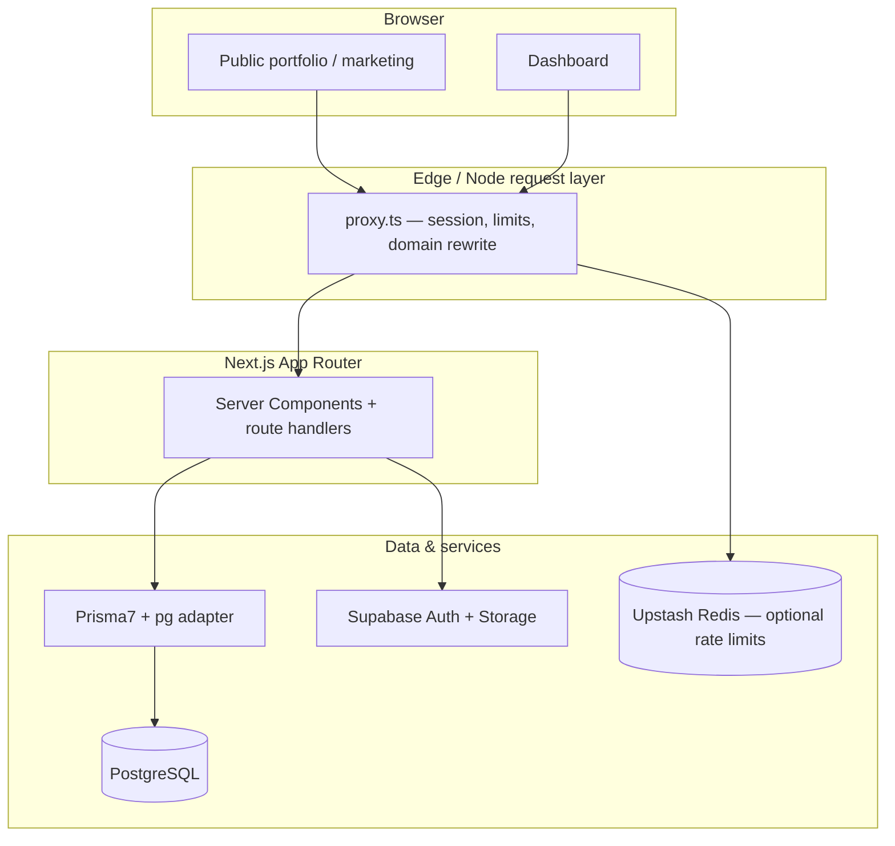

# Visora (Multi-tenant portfolio)

↑ [[Entities/Projects/Visora|Visora]]

## Links

- [[Entities/Projects/Visora]]

A **multi-tenant portfolio platform**: each customer gets a **public portfolio site** (by path or custom domain) and an **authenticated dashboard** to edit profile, projects, skills, gallery, theme, and more. The app combines **Next.js App Router**, **Supabase Auth**, **Prisma 7 + PostgreSQL**, **HeroUI v3**, and **Tailwind CSS v4**.

This document is the **main project guide**. For AI assistants working in this repo

---

## Table of contents

1. [What you can build with this](#what-you-can-build-with-this)
2. [High-level architecture](#high-level-architecture)
3. [Tech stack](#tech-stack)
4. [Repository layout](#repository-layout)
5. [Prerequisites](#prerequisites)
6. [Local setup](#local-setup)
7. [Environment variables](#environment-variables)
8. [Data model & multi-tenancy](#data-model--multi-tenancy)
9. [Authentication & access control](#authentication--access-control)
10. [Routing & public portfolios](#routing--public-portfolios)
11. [Request pipeline (`proxy.ts`)](#request-pipeline-proxyts)
12. [API surface (overview)](#api-surface-overview)
13. [Subscriptions & billing posture](#subscriptions--billing-posture)
14. [Admin](#admin)
15. [Rate limiting, Turnstile, contact](#rate-limiting-turnstile-contact)
16. [Theming & live preview](#theming--live-preview)
17. [Database workflows (Prisma)](#database-workflows-prisma)
18. [Testing](#testing)
19. [Deployment](#deployment)
20. [Troubleshooting](#troubleshooting)
21. [Further reading](#further-reading)

---

## What you can build with this

- **Marketing site** — Home, pricing, contact, legal pages under `app/`.
- **Per-tenant public portfolios** — SEO metadata, OG images, layouts driven by `ThemeConfig`.
- **Dashboard** — CRUD for portfolio entities, theme editor, domain settings, inbound contact messages.
- **Invite-only onboarding** — Registration is gated by `InviteToken` rows in the database.
- **Custom domains** — Hostname → tenant rewrite for published tenants with `customDomain` set.
- **Operational controls** — Admin UI + APIs for invite tokens and subscriptions (for operators, not end users).

---

## High-level architecture



- **Source of truth for portfolio content** is PostgreSQL via Prisma (`Tenant` and related models).
- **Identity** is Supabase Auth (JWT/session cookies); the app links `auth.users` to a `User` row (same `id`) and a 1:1 `Tenant`.
- **Files** (avatars, gallery, etc.) use Supabase Storage patterns under `lib/supabase/`.

---

## Tech stack

| Layer          | Choice                                                                              |
| -------------- | ----------------------------------------------------------------------------------- |
| Framework      | Next.js **16** (App Router), React **19**                                           |
| UI             | HeroUI **v3** (`@heroui/react`, `@heroui/styles`), Tailwind **v4**                  |
| ORM / DB       | Prisma **7**, PostgreSQL, `@prisma/adapter-pg`                                      |
| Auth           | Supabase (`@supabase/ssr`, `@supabase/supabase-js`)                                 |
| Validation     | Zod                                                                                 |
| Forms          | react-hook-form + `@hookform/resolvers`                                             |
| Rate limit     | `@upstash/ratelimit` + `@upstash/redis` (optional; fails open if Redis unavailable) |
| Bot protection | Cloudflare Turnstile (`@marsidev/react-turnstile`)                                  |
| Unit tests     | Vitest                                                                              |
| E2E            | Playwright                                                                          |

Package manager: **pnpm** (see `package.json` `packageManager` field).

---

## Repository layout

| Path          | Role                                                                                                                    |
| ------------- | ----------------------------------------------------------------------------------------------------------------------- |
| `app/`        | Routes: marketing, `(auth)`, `(dashboard)`, `(admin)`, dynamic `[slug]` / `p/[slug]`, `api/*`                           |
| `components/` | React components (dashboard, portfolio, marketing, auth)                                                                |
| `lib/`        | Prisma singleton, env parsing, portfolio helpers, subscription/admin guards, Supabase clients, rate limits, validations |
| `prisma/`     | `schema.prisma`, migrations, `seed.ts`                                                                                  |
| `proxy.ts`    | Central request hook: custom domain rewrite, rate limits, Supabase session refresh, auth redirects                      |
| `e2e/`        | Playwright specs                                                                                                        |
| `__tests__/`  | Vitest tests                                                                                                            |

---

## Prerequisites

- **Node.js** compatible with Next16 (see Next.js docs for current requirement).
- **pnpm** (version pinned in `package.json`).
- **PostgreSQL** database URL (local Docker, Neon, Supabase Postgres, etc.).
- **Supabase project** for authentication (and typically storage).

---

## Local setup

1. **Clone and install**

   ```bash
   pnpm install
   ```

2. **Configure environment** — Create `.env.local` (see [Environment variables](#environment-variables)).

3. **Migrate and generate Prisma client**

   ```bash
   pnpm db:migrate
   # or during early prototyping: pnpm db:push
   pnpm db:generate
   ```

4. **Seed a demo portfolio (optional)**

   ```bash
   pnpm db:seed
   ```

   The seed creates a published tenant at slug `layout-showcase` (see comments in `prisma/seed.ts`).

5. **Run the dev server**

   ```bash
   pnpm dev
   ```

6. **Open** `http://localhost:3000` — public routes; dashboard at `/dashboard` after a real user/session exists.

---

## Environment variables

Values are validated in [`lib/env/server.ts`](./lib/env/server.ts) and [`lib/env/public.ts`](./lib/env/public.ts). Below is a practical checklist.

### Required (typical)

| Variable                                                                                                                           | Scope  | Purpose                                                     |
| ---------------------------------------------------------------------------------------------------------------------------------- | ------ | ----------------------------------------------------------- |
| `DATABASE_URL`                                                                                                                     | Server | PostgreSQL connection string for the app + Prisma           |
| `NEXT_PUBLIC_SUPABASE_URL`                                                                                                         | Public | Supabase project URL                                        |
| One of: `NEXT_PUBLIC_SUPABASE_PUBLISHABLE_DEFAULT_KEY`, `NEXT_PUBLIC_SUPABASE_PUBLISHABLE_KEY`, or `NEXT_PUBLIC_SUPABASE_ANON_KEY` | Public | Supabase anon / publishable key for browser + server client |
| One of: `SUPABASE_SECRET_KEY` or `SUPABASE_SERVICE_ROLE_KEY`                                                                       | Server | Service role / secret for privileged Supabase operations    |

### Strongly recommended

| Variable              | Purpose                                                                                                                                                    |
| --------------------- | ---------------------------------------------------------------------------------------------------------------------------------------------------------- |
| `NEXT_PUBLIC_APP_URL` | Canonical app URL (default `http://localhost:3000` in public env); used for rewrites, links, OG URLs                                                       |
| `DIRECT_URL`          | Direct Postgres URL for migrations when using a pooler (e.g. Supabase); used when `PRISMA_USE_DIRECT_URL=1` — see [`prisma.config.ts`](./prisma.config.ts) |

### Optional but common in production

| Variable                                                       | Purpose                                                                                                                                 |
| -------------------------------------------------------------- | --------------------------------------------------------------------------------------------------------------------------------------- |
| `UPSTASH_REDIS_REST_URL` / `UPSTASH_REDIS_REST_TOKEN`          | Rate limiting for contact, auth, OG, and public portfolio API routes                                                                    |
| `TURNSTILE_SECRET_KEY`                                         | Server-side Turnstile verification                                                                                                      |
| `NEXT_PUBLIC_TURNSTILE_SITE_KEY`                               | Turnstile widget on forms                                                                                                               |
| `NEXT_PUBLIC_CONTACT_EMAIL`, `NEXT_PUBLIC_CONTACT_PHONE`, etc. | Marketing contact page content — see [`components/marketing/contact-page-content.tsx`](./components/marketing/contact-page-content.tsx) |

### E2E / CI bypass (never enable in production)

| Variable                       | Purpose                                                 |
| ------------------------------ | ------------------------------------------------------- |
| `E2E_BYPASS_AUTH`              | Server-side bypass for automated tests                  |
| `PLAYWRIGHT_ENABLE_E2E_BYPASS` | Smoke tests helper — see `e2e/deployment-smoke.spec.ts` |

---

## Data model & multi-tenancy

The schema lives in `prisma/schema.prisma`.

- **`User`** — App user; `id` aligns with Supabase Auth user id. Optional `passwordHash` for legacy/hybrid flows; primary login is Supabase.
- **`Tenant`** — **One per user** (`userId` unique). Key fields:
  - `slug` — Public path segment (`/p/{slug}` and `/{slug}`).
  - `customDomain` — Optional hostname for custom domain hosting.
  - `isPublished` — Gates public visibility.
- **Portfolio entities** — All scoped by `tenantId`: `Profile`, `Project`, `Skill`, `Experience`, `Education`, `SocialLink`, `GalleryImage`, `Contact` (inbound messages), `ThemeConfig`.
- **Analytics-style** — `PortfolioView` deduplicates visits per visitor hash per day.
- **Business** — `InviteToken` (registration gate), `Subscription` (access window and status).

**Rule of thumb for engineers:** any query that mutates portfolio data must enforce **tenant isolation** (filter by the current user’s `tenantId` or join through `Tenant` → `userId`). The shared client is `lib/prisma.ts` (`import { prisma } from "@/lib/prisma"`).

---

## Authentication & access control

1. **Supabase session** — Created and refreshed via `@supabase/ssr` in `lib/supabase/server.ts` and `lib/supabase/middleware.ts` (used from `proxy.ts`).
2. **Dashboard** — `app/(dashboard)/layout.tsx` requires a Supabase user, a `Tenant` row in Prisma, and (unless `isAdmin`) a **valid subscription** — see `lib/subscription.ts`.
3. **Registration** — `app/api/auth/register/route.ts` validates an **invite token**, checks slug availability, creates the Supabase user, and provisions `User` + `Tenant` + default theme/profile data.
4. **Email verification** — `lib/supabase/sync-email-verification.ts` keeps Prisma `emailVerified` in sync when the session user is verified.

Auth-related UI patterns are summarized in `components/auth/README_V2.md`.

---

## Routing & public portfolios

| Route area       | Path examples                                                | Notes                                                                              |
| ---------------- | ------------------------------------------------------------ | ---------------------------------------------------------------------------------- |
| Marketing        | `/`, `/pricing`, `/contact`, `/privacy`, `/terms`            | Static/marketing content                                                           |
| Auth             | `/login`, `/register`, `/forgot-password`, `/reset-password` | Route group `(auth)`                                                               |
| Dashboard        | `/dashboard`, `/dashboard/projects`, …                       | Route group `(dashboard)`                                                          |
| Admin            | `/admin`, `/admin/invite-tokens`, `/admin/subscriptions`     | Route group `(admin)`; API guarded by `lib/admin-guard.ts` |
| Public portfolio | `/{slug}`, `/p/{slug}`                                       | **`/p/[slug]` re-exports** the same module as `[slug]` — one implementation        |
| APIs             | `/api/**`                                                    | JSON route handlers                                                                |

**Published-only public pages:** Portfolio loaders use helpers in `lib/portfolio.ts` (e.g. `getPublishedTenantBySlug`) so drafts or unpublished tenants are not exposed.

---

## Request pipeline (`proxy.ts`)

`proxy.ts` runs on matched routes (see `config.matcher`) and:

1. **Custom domains** — If `Host` is not the main app hostname (and not localhost / `vercel.app`), looks up `Tenant.customDomain` + `isPublished` and **rewrites** to `/p/{slug}`.
2. **Rate limiting** — Applies Upstash limits to selected API prefixes (contact, auth, OG, public portfolio); **fails open** on Redis errors.
3. **Session** — Calls `updateSession` so Supabase cookies stay fresh.
4. **Email sync** — `syncVerifiedEmail(user)` after session resolution.
5. **Redirects** — `/dashboard/*` requires a user; `/login` and `/register` redirect to `/dashboard` if already authenticated.

> **Note:** This file is the project’s central “middleware-style” entrypoint. If you upgrade Next.js, confirm the framework still picks up this filename and export shape, or rename/move per the version’s docs under `node_modules/next/dist/docs/`.

---

## API surface (overview)

Grouped by concern (non-exhaustive; explore `app/api/` for full list):

| Prefix                              | Purpose                                                                                |
| ----------------------------------- | -------------------------------------------------------------------------------------- |
| `/api/auth/*`                       | Logout, register, resend verification                                                  |
| `/api/portfolio/*`                  | Authenticated CRUD for profile, projects, skills, experience, gallery, theme, settings |
| `/api/public-portfolio/[slug]`      | Cached/public aggregate for portfolio JSON consumers                                   |
| `/api/contact`, `/api/site-contact` | Contact submissions (rate limited)                                                     |
| `/api/custom-domain/*`              | Connect / status for custom hostname workflow                                          |
| `/api/views/[slug]`                 | View counting / analytics                                                              |
| `/api/og/portfolio/[slug]`          | Dynamic Open Graph image                                                               |
| `/api/admin/*`                      | Invite tokens, subscriptions, stats (admin only)                                       |
| `/api/health`                       | Health check                                                                           |
| `/api/e2e/session`                  | Test session helper (development/testing)                                              |

Implementations should validate input (Zod in `lib/validations.ts` and route-local schemas), return appropriate HTTP statuses, and **scope data to the authenticated tenant** unless the route is explicitly public.

---

## Subscriptions & billing posture

- Subscriptions are modeled in **`Subscription`** with `status`, `startsAt`, `endsAt`, `plan`, optional `paymentRef` / `notes`.
- `lib/subscription.ts` implements **lazy expiry** (ACTIVE + past `endsAt` flips to EXPIRED).
- Non-admin users with expired, suspended, missing, or pending subscription are redirected to `app/subscription-expired/page.tsx`.

This repo does **not** mandate a specific payment provider; subscription rows are the contract the app enforces.

---

## Admin

- **Flag:** `User.isAdmin` in the database.
- **Guard:** `requireAdmin()` for admin APIs.
- **UI:** `(admin)` routes for invite token issuance and subscription management.

---

## Rate limiting, Turnstile, contact

- **Redis:** `lib/rate-limit.ts` — if env vars are missing or Redis errors occur, routes still work (limits disabled).
- **Turnstile:** Server verification in `lib/turnstile.ts`; see also `turnstile-guide.md`.
- **Contact page content:** Optional env-driven business details in `contact-page-guide.md`.

---

## Theming & live preview

- **`ThemeConfig`** stores colors, fonts, layout mode, optional dark overrides, and `customCss`.
- Presets and defaults are referenced from `lib/theme-config.ts` and API routes under `/api/portfolio/theme`.
- **Live updates:** `lib/live-portfolio.ts` uses `BroadcastChannel` + `localStorage` to nudge open portfolio tabs when the editor saves.

---

## Database workflows (Prisma)

| Command                  | When to use                                                     |
| ------------------------ | --------------------------------------------------------------- |
| `pnpm db:migrate`        | Create/apply migrations in development                          |
| `pnpm db:direct:migrate` | `migrate deploy` with `PRISMA_USE_DIRECT_URL=1` (pooler bypass) |
| `pnpm db:generate`       | Regenerate client after schema changes                          |
| `pnpm db:push`           | Quick prototype against a dev DB (no migration files)           |
| `pnpm db:studio`         | Inspect tables                                                  |
| `pnpm db:seed`           | Load demo data                                                  |

Configuration: `prisma.config.ts` loads `.env.local` / `.env` for CLI commands and supports `DIRECT_URL` when `PRISMA_USE_DIRECT_URL=1`.

---

## Testing

| Command               | Description                                 |
| --------------------- | ------------------------------------------- |
| `pnpm test`           | Vitest                                      |
| `pnpm test:coverage`  | Coverage run                                |
| `pnpm test:e2e`       | Playwright (headed)                         |
| `pnpm test:e2e:smoke` | Smoke config (`playwright.smoke.config.ts`) |

Tests live in `__tests__/` and `e2e/`. Auth bypass is **strictly** for test environments — see `lib/supabase/e2e-auth.ts`.

---

## Deployment

- **Vercel:** `vercel.json` sets `pnpm install --frozen-lockfile` and `pnpm build` (which runs `prisma generate` then `next build`).
- Set **all production env vars** from the tables above.
- Ensure **PostgreSQL** is reachable from Vercel and **Supabase** URLs/keys match the deployment domain (`NEXT_PUBLIC_APP_URL`).
- **Custom domains:** Tenants configure `customDomain` in settings; DNS must point to your hosting; `proxy.ts` resolves hostname → portfolio.

---

## Troubleshooting

| Symptom                             | Things to check                                                                                       |
| ----------------------------------- | ----------------------------------------------------------------------------------------------------- |
| Env validation errors on boot       | `DATABASE_URL`, Supabase URL, publishable key, service role/secret key                                |
| Prisma migrate fails on Supabase    | Set `DIRECT_URL` and use `PRISMA_USE_DIRECT_URL=1` for CLI — `prisma.config.ts` |
| Dashboard always redirects to login | Supabase session cookies, `NEXT_PUBLIC_APP_URL`, same-site cookie settings                            |
| Custom domain shows wrong site      | `Tenant.customDomain` exact hostname, `isPublished`, DNS, `proxy.ts` rewrite                          |
| Rate limits never trigger           | `UPSTASH_*` vars unset or Redis errors (check logs — design is fail-open)                             |

---

## Further reading

- `AGENTS.md` — Next.js + HeroUI v3 agent notes (local docs paths).
- `CLAUDE.md` — Pointers to `AGENTS.md`.
- `.cursor/rules/` — Project conventions (Prisma, Next.js, UI, styling).
- `components/auth/README_V2.md` — Auth UI v2 notes.
- `turnstile-guide.md`, `contact-page-guide.md` — Feature-specific setup.

---

## Scripts reference

| Script             | Command      |
| ------------------ | ------------ |
| Dev                | `pnpm dev`   |
| Build              | `pnpm build` |
| Start (production) | `pnpm start` |
| Lint               | `pnpm lint`  |

---

_Documentation reflects the repository as of the last update to this file; always verify behavior against the code paths linked above._
