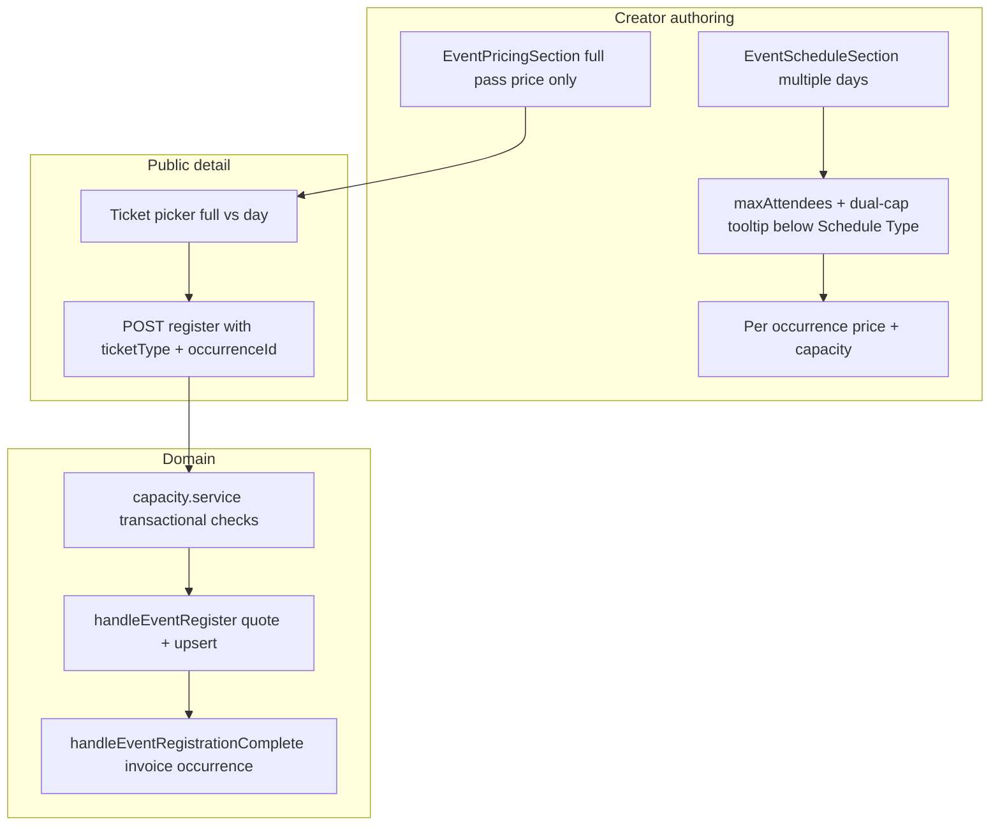

# Multi-day event tickets and capacity

## Product decisions (locked)

- **Ticket types** (only when `scheduleType === "multiple"`): **Full event pass** (all occurrences, uses event-level price) **or** **single-day ticket** (one `EventOccurrence`, own price).
- **Capacity**: **Both** optional **event-wide** `maxAttendees` and **per-occurrence** caps; authoring UI includes an **info tooltip** explaining how each limit applies (en/ar/es).
- **Checkout (MVP)**: One ticket per transaction (one full pass **or** one day). User may hold multiple day tickets via separate purchases (separate registration rows), but not duplicate the same scope (same day or second full pass).

**Backward compatibility**: `single` and `recurring` events behave as today (implicit full-event registration, event `price`, event `maxAttendees`). Existing `multiple` events and registrations are backfilled as full-event tickets.

---

## Current gaps (baseline)

| Area | Today |
|------|--------|
| Registration | [`EventRegistration`](apps/experts-app/prisma/schema.prisma) `@@unique([eventId, userId])` — one row per user per event, no occurrence |
| Register API | [`EventRegisterSchema`](apps/experts-app/src/lib/events/commands/event-register.schema.ts) — no `ticketType` / `occurrenceId` |
| Capacity | UI-only `spotsLeft` from event `maxAttendees` — [`use-event-detail.ts`](apps/experts-app/src/lib/events/detail/use-event-detail.ts); **not** enforced in [`event-register.handler.ts`](apps/experts-app/src/lib/events/handlers/event-register.handler.ts) |
| Per-day data | [`EventOccurrence`](apps/experts-app/prisma/schema.prisma) has `capacityOverride` but create/update never set it; no per-day price |
| Invoicing | [`event-registration-complete.handler.ts`](apps/experts-app/src/lib/events/handlers/event-registration-complete.handler.ts) always uses `occurrences[0]` for invoice `occurrenceId` |
| Refunds | [`event-registration-refund-request.handler.ts`](apps/experts-app/src/lib/events/registrations/handlers/event-registration-refund-request.handler.ts) looks up by `eventId_userId` |

Partial hook: payment verify already accepts optional `occurrenceId` in [`EventRegistrationCompleteSchema`](apps/experts-app/src/lib/events/commands/event-registration-complete.schema.ts) — wire through end-to-end after registration stores the selection.

---

## Target architecture



### Capacity rules (document in tooltip + domain tests)

- **Full-event pass** (completed registration, `ticketType = full_event`):
  - Consumes **1** toward `Event.maxAttendees` (if set).
  - Consumes **1** toward **each** non-cancelled occurrence’s cap (if that occurrence’s cap is set).
- **Single-day ticket** (`ticketType = single_occurrence`, `occurrenceId` set):
  - Consumes **1** toward that occurrence’s cap (if set).
  - Consumes **1** toward `Event.maxAttendees` (if set).
- **Sold out** when either applicable limit is reached for the ticket being purchased.
- Count only registrations with `status = completed` (align with [`event.include.ts`](apps/experts-app/src/lib/events/includes/event.include.ts)).

### Mutual exclusion (register handler)

- If user has **completed** `full_event` → reject further purchases for that event.
- If user has **completed** `full_event` → N/A (blocked).
- If user has any **completed** single-day ticket → reject **full_event** purchase.
- If user already has **completed** ticket for same `occurrenceId` → reject duplicate day.

Pending payment rows should reserve capacity (count `pending` + `completed` for cap checks) to avoid oversell — match how spots are displayed today or tighten both UI and server consistently.

---

## 1. Schema and migration

**File:** [`apps/experts-app/prisma/schema.prisma`](apps/experts-app/prisma/schema.prisma)

- Add enum `EventRegistrationTicketType`: `full_event` | `single_occurrence`.
- Extend `EventRegistration`:
  - `ticketType` (default `full_event` for backfill)
  - `occurrenceId` (nullable FK → `EventOccurrence`, `onDelete: Restrict`)
  - Replace `@@unique([eventId, userId])` with `@@unique([eventId, userId, ticketScopeKey])` where `ticketScopeKey` is a generated/stored string: `'full'` or occurrence UUID (avoids PostgreSQL NULL uniqueness issues).
- Extend `EventOccurrence`:
  - `price` `Decimal?` — day ticket list price (ex-VAT authoring, same semantics as `Event.price`)
  - Keep `capacityOverride` as the per-day cap (expose as `capacity` in DTOs).
- Extend `Event` (multiple schedule only in UI, optional DB flags):
  - `fullEventPassEnabled` `Boolean` default `true` (allow disabling full pass when only selling days)
  - Optionally `singleDayTicketsEnabled` default `true` when `scheduleType = multiple` (can be derived in app layer if you prefer fewer columns).

**Migration SQL:** backfill all existing registrations: `ticketType = full_event`, `ticketScopeKey = 'full'`, `occurrenceId = NULL`.

**Deprecate:** stop writing [`EventSlot`](apps/experts-app/prisma/schema.prisma) on new flows (already unused in create/update); leave table for legacy/clone until a separate cleanup issue.

---

## 2. Domain module: capacity and pricing

**New:** `apps/experts-app/src/lib/events/capacity/` (or under `registrations/`)

- `resolveTicketPrice(event, occurrenceId?, ticketType)` — full pass uses `event.price`; day uses `occurrence.price ?? event.price` (document fallback policy in code comment).
- `assertRegistrationCapacity({ eventId, ticketType, occurrenceId, tx })` — transactional counts + throws `DomainError` with stable codes (`EVENT_SOLD_OUT`, `DAY_SOLD_OUT`, `ALREADY_REGISTERED`).
- `getCapacitySnapshot(eventId)` — for public DTO and creator dashboard: per-occurrence `registered / capacity`, event-wide `registered / maxAttendees`, `spotsLeft` per ticket type.

**Update:** [`event-register.handler.ts`](apps/experts-app/src/lib/events/handlers/event-register.handler.ts)

- Accept `ticketType` + `occurrenceId` (Zod in [`event-register.schema.ts`](apps/experts-app/src/lib/events/commands/event-register.schema.ts)).
- Validate occurrence belongs to event, not cancelled, in the future (reuse schedule helpers).
- Call `assertRegistrationCapacity` before upsert.
- Quote `computeChargeQuote` from resolved ticket price (not always `event.price`).
- Upsert on new unique key; store `occurrenceId` + `ticketType` on pending/completed rows.

**Update:** [`event-registration-complete.handler.ts`](apps/experts-app/src/lib/events/handlers/event-registration-complete.handler.ts)

- Load registration’s `occurrenceId` / `ticketType`; for invoice use registration’s occurrence (or first occurrence for `full_event` if invoice still requires one line — prefer stored primary occurrence or pass `command.occurrenceId` from PSP metadata that matches registration).

**Update:** PSP intent metadata (Stripe/Noon/Tabby paths in payment service) to include `ticketType` + `occurrenceId` so verify/webhooks reconcile with pending row.

---

## 3. API and DTOs

- [`event.mapper.ts`](apps/experts-app/src/lib/events/mappers/event.mapper.ts) / [`event.dto.ts`](apps/experts-app/src/lib/events/dto/event.dto.ts):
  - `EventOccurrenceDTO`: `price`, `capacity`, `registeredCount`, `spotsLeft`, `isSoldOut`
  - `EventDTO`: `fullEventPassEnabled`, `ticketOptions` summary for multiple schedule
  - `isRegistered` → `registrations: UserEventRegistrationSummary[]` (ticket type + occurrence label) for multiple events; keep boolean for simple schedules
- [`event-create.handler.ts`](apps/experts-app/src/lib/events/handlers/event-create.handler.ts) / [`event-update.handler.ts`](apps/experts-app/src/lib/events/handlers/event-update.handler.ts):
  - Persist occurrence `price` + `capacityOverride` from form payload when `scheduleType === "multiple"`.
- [`buildEventSchedule`](apps/experts-app/src/lib/events/helpers/schedule.ts) — unchanged for dates; occurrence createMany includes new fields from form slots.

**Server-side sold-out:** return 409 from register when capacity exceeded (UI already disables — align counts).

---

## 4. Authoring UI

### Layout change: `maxAttendees` lives under Schedule (not Pricing)

**Rationale:** Event-wide capacity is tied to how many people can attend the scheduled experience, not to list price. Today `maxAttendees` is rendered as the `trailing` slot on [`CreatorPricingFields`](apps/experts-app/src/lib/pricing/components/creator-pricing-fields.tsx) inside [`event-pricing-section.tsx`](apps/experts-app/src/lib/events/forms/sections/event-pricing-section.tsx) — **relocate** it to [`event-schedule-section.tsx`](apps/experts-app/src/lib/events/forms/sections/event-schedule-section.tsx).

**Placement:** Immediately **below the Schedule Type** `RadioGroup` (after `scheduleType` single / multiple / recurring), before the type-specific date/time blocks. Same field for all schedule types (`single`, `multiple`, `recurring`).

**Implementation notes:**

- Remove the `trailing` `NumberField` block from `EventPricingSection` (pricing accordion stays price/free/tax/currency only).
- Add `maxAttendees` `NumberField` + validation error display in `EventScheduleSection`; pass `errors` / `updateField` (already on props).
- For `scheduleType === "multiple"`, add a **Tooltip** (HeroUI) beside `maxAttendeesLabel` explaining **dual limits**: event-wide `maxAttendees` vs per-occurrence caps on day rows (en/ar/es in `creator.json`). For single/recurring, tooltip can describe event-wide cap only (shorter copy or shared key with conditional text).
- [`event-form.tsx`](apps/experts-app/src/lib/events/forms/event-form.tsx): no accordion reorder required — field moves within the **Schedule** panel only (Pricing panel remains above Schedule in the accordion list).
- **Tests:** Move/adjust assertions from [`event-pricing-section.test.tsx`](apps/experts-app/src/lib/events/forms/sections/__tests__/event-pricing-section.test.tsx) to schedule-section tests (or add `event-schedule-section.test.tsx`).

### Other authoring work (unchanged scope)

- [`event-schedule-section.tsx`](apps/experts-app/src/lib/events/forms/sections/event-schedule-section.tsx): for each time slot when `scheduleType === "multiple"`, add **per-day capacity** and **price** (SAR); extend [`TimeSlot`](apps/experts-app/src/lib/events/forms/event.form.ts).
- [`event-pricing-section.tsx`](apps/experts-app/src/lib/events/forms/sections/event-pricing-section.tsx): full-event pass price (existing `price`) + toggle `fullEventPassEnabled` when multiple — **no** `maxAttendees` here.
- [`event.mapper.ts`](apps/experts-app/src/lib/events/forms/event.mapper.ts) submit/load mapping for new fields (unchanged — `maxAttendees` still on `EventFormValues`).
- Zod: [`event.schema.ts`](apps/experts-app/src/lib/events/forms/event.schema.ts) / create-update commands — validate at least one ticket mode enabled for multiple; per-day price ≥ 0; capacity optional positive int.

---

## 5. Public registration UI

- [`event-detail-sidebar.tsx`](apps/experts-app/src/lib/events/detail/sections/event-detail-sidebar.tsx) / [`event-detail-mobile-bar.tsx`](apps/experts-app/src/lib/events/detail/sections/event-detail-mobile-bar.tsx) / [`use-event-detail.ts`](apps/experts-app/src/lib/events/detail/use-event-detail.ts):
  - When `schedule.type === "multiple"`, show ticket picker (full pass card + list of days with price/spots).
  - Pass selection into `handleRegister`.
  - Recompute `spotsLeft` / payable amount from selection (coupons: apply to selected ticket price — same campaign rules, document if coupons are full-event-only in v1).
- [`event-detail-dates.tsx`](apps/experts-app/src/lib/events/detail/sections/event-detail-dates.tsx): optionally show per-day sold-out chips from DTO.

---

## 6. Creator visibility

- [`creator/events/[id]/page.tsx`](apps/experts-app/app/(i18n)/_shared/creator/events/[id]/page.tsx): per-occurrence registration counts; segment full-pass vs day tickets.
- [`event-registration.mapper.ts`](apps/experts-app/src/lib/events/registrations/mappers/event-registration.mapper.ts): map `ticketType`, occurrence date (not `occurrences[0]`).
- Registrations list filters/columns: ticket type + day.

---

## 7. Refunds and user flows

- Refund request API: accept **`registrationId`** (keep `eventId` for backward compat but resolve specific row when multiple exist).
- [`evaluateEventRefundEligibility`](apps/experts-app/src/lib/events/registrations/event-refund-policy.ts): for single-day tickets, use **that occurrence’s** `startsAt` for “event started” rule.
- [`event-detail.handler.ts`](apps/experts-app/src/lib/events/handlers/event-detail.handler.ts): load all non-cancelled registrations for user; private access if any valid registration.

---

## 8. Tests and verification

| Layer | Focus |
|-------|--------|
| Unit | `assertRegistrationCapacity`, price resolution, mutual exclusion |
| Unit | [`event-register.handler.test.ts`](apps/experts-app/src/lib/events/handlers/__tests__/event-register.handler.test.ts) — sold out, day vs full |
| Unit | refund policy per occurrence |
| API | register route + verify route with `occurrenceId` |
| Manual | Create multiple-day event → sell full pass until event cap → sell day until day cap → RTL tooltip copy |

Run: `cd apps/experts-app && pnpm test:unit` on touched paths; optional integration test with Prisma transaction for capacity race.

---

## 9. GitHub issue (create after plan approval)

**Repo:** `logi-x/experts`

**Command (agent/user after approval):**

```bash
gh issue create --repo logi-x/experts --title "Events: multi-day ticket types (full pass + per-day) with dual capacity" --body "$(cat <<'EOF'
## Summary
Multi-date events (`scheduleType = multiple`) need explicit ticket types: **full-event pass** (all days, event price) and **per-day tickets** (per-occurrence price and capacity). Support **both** event-wide `maxAttendees` and per-occurrence caps, with server-enforced checkout and creator reporting.

## Background
Today registration is one row per user per event with no day selection; capacity is UI-only at event level; `EventOccurrence.capacityOverride` and payment `occurrenceId` hooks exist but are not wired through register/authoring.

## Scope
- [ ] Prisma: `ticketType`, `ticketScopeKey`, `occurrenceId` on `EventRegistration`; `price` on `EventOccurrence`; migration backfill
- [ ] Domain: capacity service (full pass counts against all day caps + event cap); register/complete handlers
- [ ] Authoring: move maxAttendees below Schedule Type (+ dual-cap tooltip for multiple); per-day price/capacity; full-pass toggle in pricing only
- [ ] Public UI: ticket picker on event detail; server sold-out enforcement
- [ ] Creator: registrations show ticket type/day; per-occurrence fill metrics
- [ ] Refunds: by `registrationId`; eligibility uses selected occurrence for day tickets
- [ ] Tests: capacity, mutual exclusion, register/complete/refund

## Out of scope (follow-ups)
- Multi-day cart (several days in one payment)
- `EventSlot` table removal
- Per-day coupons / affiliate splits

## References
- Implementation plan: (link PR or internal doc when branch opens)
- Key files: `event-register.handler.ts`, `event-registration-complete.handler.ts`, `event-schedule-section.tsx`, `schema.prisma` `EventRegistration` / `EventOccurrence`

EOF
)"
```

Add labels per team convention (e.g. `area:events`, `type:feature`) if they exist.

---

## Suggested implementation order

1. Schema + migration + capacity/pricing pure functions + tests  
2. Register + complete + payment metadata  
3. Create/update handlers + form mapping  
4. Authoring UI + i18n tooltip  
5. Public ticket picker + DTO capacity fields  
6. Creator/refund adjustments  
7. Open GitHub issue (or at kickoff if you prefer tracking before code)

---

**Project:** [[Projects/Experts/Experts App/Plans & Sessions|Experts App — Plans & Sessions]]
