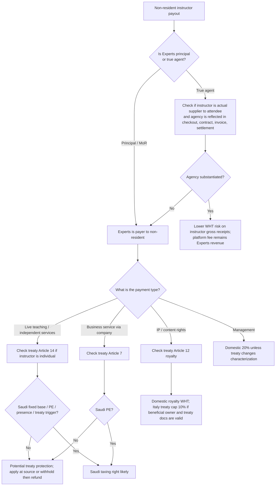

# Saudi Withholding Tax Analysis for Experts

## Executive summary

The short answer is **no**: Saudi withholding tax does **not** apply merely because money “moves outside KSA.” Under the Saudi Income Tax Law, the trigger is a payment by a **resident** or a **Saudi permanent establishment** to a **non-resident** from a **Saudi source**, and the source question is determined by the Income Tax Law’s source rules, not by the payment rail, settlement currency, or the fact that the beneficiary’s bank account is abroad. citeturn16view0turn14view0

For Experts, the critical issue is therefore **how the instructor payout is characterized** and **what legal model the platform is actually using**. If Experts is the **merchant of record** and contracts with the customer in its own name, the instructor payout is much more likely to be viewed as a payment by a Saudi resident to a non-resident, so Saudi WHT analysis becomes relevant. If Experts is a true **agent/disclosed marketplace** and the instructor is the supplier to the attendee, the WHT risk on the instructor’s gross receipts is materially lower, but only if the contracts, checkout, invoicing, settlement mechanics, and platform controls all match that agency story in substance. This is an inference from the payer rule in Article 68, the source rules in Article 5, and ZATCA’s VAT rule deeming certain portals to be suppliers for electronically supplied services. citeturn16view0turn14view0turn25view2

For an **Italian individual instructor**, the Saudi–Italy treaty can be highly important. The treaty contains **no separate “technical services” article**; instead, the relevant treaty articles are usually **Article 14** for independent personal services, **Article 7** for business profits where the instructor operates through an enterprise, and **Article 12** where the payment is really a royalty. That means a live, in-person Italy event taught by an Italian individual often has a **stronger treaty position** than a payout for recorded content, sublicensing, or platform rights, which carry much more **royalty risk**. citeturn6view0turn5view6turn27view2turn6view2

The most important practical conclusion for Experts is this: **do not hard-code a blanket 5% WHT because funds are remitted abroad**. Instead, build a classification layer that decides, per payout, whether the payment is a teaching/service fee, business profit, royalty, management fee, or another category; whether the instructor is an individual or an entity; whether Experts is principal or agent for that SKU; and whether treaty relief has been obtained at source or will be claimed via refund. citeturn16view0turn8view3turn8view0

## Saudi domestic withholding tax framework

Article 68 of the Saudi Income Tax Law provides the core rule: every **resident**, whether or not itself taxable, and every **Saudi permanent establishment of a non-resident**, that pays an amount to a **non-resident** from a **source in the Kingdom** must withhold tax. The same article places the remittance, reporting, and recordkeeping burden on the withholding payer; requires payment to the authority within the **first ten days of the month following the month of payment**; requires a certificate to the beneficiary; and makes the withholding person **personally liable** for unpaid tax and delay fines if it fails to withhold, pay, or report correctly. citeturn16view0turn15view3

Saudi-source income is defined in Article 5. For present purposes, the most important source rules are that income is Saudi-source if it is derived from activity in the Kingdom, from IP used in the Kingdom, from dividends and management/directors’ fees paid by a Saudi resident company, from amounts paid by a resident company to its head office or affiliate for services, and from amounts paid by a resident for services performed wholly or partly in the Kingdom. Article 5 also says that the **place of payment does not control the source**. citeturn14view0

Article 68’s statutory rate buckets include **5% for rent**, **15% for royalties/proceeds**, **20% for management fees**, **5% for airline tickets and air or maritime freight**, **5% for international telecommunications services**, plus a regulated residual category for other payments. Article 68 also states that the tax withheld is generally **final** for a non-resident without a Saudi PE, but if the non-resident has a Saudi PE and the payment is directly connected to that PE’s business, the amount instead goes into the PE’s income tax base rather than staying in final WHT. citeturn16view0turn16view1

In current Saudi practice materials, **technical and consultancy services are treated at 5%**, and ZATCA’s FAQ states that repair work by a non-resident without a Saudi PE is subject to **5% WHT as technical and consultancy services regardless of the place of service**. KPMG’s summary of the 2023 amendments likewise states that the previous 15% rate on technical/consultancy services paid to head offices or related parties was reduced to **5%**. PwC’s 2026 Saudi summary also describes current domestic WHT as using 5%, 15%, and 20% buckets, with domestic rates of **5% on dividends**, **5% on interest**, and **15% on royalties**. citeturn19view0turn29search10turn21search3

Two practical points matter a great deal for platform payouts. First, Saudi tax committees have said that WHT is triggered by **actual payment or its equivalent**, such as settlement, clearing, or set-off; it is not limited to cash wires. Second, ZATCA’s public materials show that the filing workflow is a **monthly withholding tax return**, followed by payment through SADAD/e-banking if tax is due. citeturn22view0turn8view1turn7search1

## Saudi–Italy treaty analysis

The Saudi–Italy treaty is where the analysis becomes more nuanced. For passive income, the treaty is relatively straightforward. **Dividends** are capped at **5%** if the beneficial owner is a company owning at least **25%** of the payer’s capital for at least **12 months**, and **10%** in all other cases. **Income from debt-claims** is capped at **5%**, with specific government/instrumentality exemptions. **Royalties** are capped at **10%** if the recipient is the beneficial owner. citeturn27view0turn27view1turn27view2

For services, the treaty matters more than the headline domestic WHT rate. **Article 7** says business profits of an enterprise of one state are taxable only in that state unless the enterprise carries on business in the other state through a **permanent establishment** there. The treaty’s Additional Protocol expressly says “profits” include income from the **furnishing of services**, but **do not include** personal services by an individual in an independent capacity. citeturn5view6turn6view2

That separation matters because your fact pattern often involves an **Italian individual instructor**, not an Italian company. For individuals, **Article 14** on independent personal services is the key treaty provision. It says income from professional or other independent activities is taxable only in the residence state unless one of three treaty triggers is met: the individual has a **fixed base** in the other state, is present there for more than **183 days** in a twelve-month period, or the remuneration for the activities in that other state is paid by a resident of that other state or borne by a PE there and exceeds **USD 150,000** in the fiscal year. The same article expressly includes **scientific, literary, artistic, educational, or teaching activities** within “professional services.” citeturn6view0turn6view1

For Experts, that produces a strong analytical distinction:

- If the Italian instructor is paid for **live teaching at a physical event in Italy**, the treaty case is much stronger that the income belongs in the Article 14 / Italy-taxable lane, absent Saudi fixed base, Saudi presence, or another Saudi nexus. citeturn6view0turn25view1
- If the instructor instead grants Experts rights to **use, sublicense, reproduce, or commercially exploit recorded content or course IP**, the payment begins to look like a **royalty**, and Article 12 allows Saudi taxation up to **10%** under the treaty. citeturn27view2
- If the instructor operates through an **Italian company**, the service income analysis often shifts from Article 14 to **Article 7 business profits**, which generally protects the income from Saudi tax unless that company has a Saudi **PE**. citeturn5view6turn6view2

The treaty, however, is not self-executing in practice. ZATCA’s DTAA service page says the taxpayer may request treaty application through the portal, and KPMG’s summary of ZATCA’s 2025 bulletin says treaty benefits can be claimed either **at source** or by **refund**, with required documents including a **Tax Residency Certificate**, a ZATCA-approved request form, attestation/apostille, and in at-source cases a resident undertaking (**Form Q7C**). ZATCA’s public service page still refers to **Q7B** and says the form should be signed and certified by the other tax authority. That mismatch means operational teams should check the live ZATCA portal requirements before building a fixed workflow. citeturn8view0turn8view3

## Marketplace and merchant-of-record analysis for Experts

The domestic law and treaty rules above do **not** answer the full Experts question unless the operating model is pinned down. In substance, there are two very different platform models.

If Experts is the **principal / merchant of record**, the attendee buys from Experts, Experts issues the customer invoice, Experts collects the money, and the instructor is then paid under a separate supplier agreement. In that case, the legally relevant payment for WHT is the **platform-to-instructor payout**, because Article 68 focuses on who **pays** the non-resident. Under this model, the fact that Experts retains only a commission economically does **not** by itself move the instructor’s gross entitlement outside the WHT regime. If the payout is Saudi-source and in a taxable category, WHT can apply to the payout leg. citeturn16view0turn22view0

If Experts is a true **agent / disclosed marketplace**, the instructor is the supplier to the attendee, the platform merely collects on the supplier’s behalf, and the platform’s own income is its separate commission. That model gives a much better argument that the instructor’s gross receipts are **not** a payment by Experts for services rendered to Experts. However, this only works if the legal and operational facts genuinely support agency. ZATCA’s VAT regulations create a presumption that an online interface is itself the supplier for electronically supplied services where the operator effectively controls charging, delivery, or general terms, unless the non-resident supplier is expressly identified and the operator does not control those elements. That is a **VAT rule**, not a WHT rule, but it is highly relevant evidence of whether Experts is acting like a principal or an agent in substance. citeturn25view2

This is why the same business can have two very different Saudi WHT outcomes for what looks commercially like “the same event.” A Saudi principal buying **teaching services** from an Italian instructor is one case. A Saudi intermediary merely remitting customer money to the Italian supplier is another. I did **not** find a public Saudi ruling that specifically addresses merchant-of-record course/event marketplaces paying foreign instructors, so the model analysis here is a reasoned view based on the payer rule, source rules, treaty characterization, and the VAT portal presumption. citeturn16view0turn14view0turn25view2

The decision flow below is the most practical way to model the issue for Experts. It synthesizes the domestic-law trigger, treaty characterization, and platform-structure fork discussed above. citeturn16view0turn14view0turn6view0turn5view6turn27view2



My recommended operating position for Experts is therefore:

First, **separate your catalog** into at least three tax classes: **live physical teaching**, **live online teaching/service**, and **recorded content / IP licensing**. Second, separately store whether each SKU is sold by Experts as **principal** or by the instructor with Experts as **agent**. Third, do **not** let payment-gateway geography or settlement currency decide tax treatment; those are accounting attributes, not the Saudi WHT trigger. citeturn16view0turn14view0turn25view2

## VAT interaction and invoicing

VAT and withholding tax are separate Saudi tax systems. A customer-facing sale can be **zero-rated**, **outside the Saudi place of supply**, or otherwise not subject to Saudi output VAT, while the outbound payout to a non-resident supplier still raises a separate **WHT** question. The law and regulations do not make VAT treatment a gatekeeper for WHT. citeturn16view0turn14view0turn25view0turn25view1

For **physical educational, cultural, artistic, sport, or entertainment services**, the Saudi VAT regulations say the relevant place is the **physical location** where the services are offered. They also say that where part of a service is performed in the Kingdom and part outside, the value should be split accordingly, and services performed outside the Kingdom are not viewed as performed in the Kingdom for those place-of-supply rules. That is why your earlier instinct about an Italy physical event being different from a Saudi domestic event was directionally right for VAT analysis, even though it does **not** settle WHT. citeturn25view1

For cross-border **services to non-GCC residents**, the Saudi VAT regulations generally provide a **zero rate**, subject to specific exceptions for special place-of-supply cases and certain benefit-in-the-GCC situations. For **electronically supplied services**, however, the regulations presume an online interface or portal to be the supplier in its own name where it intermediates for a non-resident supplier, unless the non-resident supplier is expressly identified and the operator does not control charging, delivery, or general terms. That rule is central if Experts starts offering **online events** or digitally delivered courses. citeturn25view0turn25view2

As to **invoice currency**, WHT itself does not force the customer-facing invoice into SAR or a foreign currency. The better way to think about it is that WHT affects the **payout ledger** and the net remittance to the instructor, while VAT/e-invoicing governs the invoice data that must be reported. ZATCA’s e-invoice data dictionary expressly contains an **Invoice Currency Code** and also a separate VAT amount in **accounting currency**, which shows that Saudi e-invoicing data structures contemplate invoice currency and accounting-currency distinctions. citeturn39search3turn39search15

Operationally, the instructor-facing settlement document should show at least: **gross amount**, **platform fee**, **WHT category**, **WHT rate**, **WHT amount**, **net remittance**, **payment currency**, **FX rate to SAR used for Saudi tax remittance/accounting**, and later the **withholding certificate number**. That design follows directly from Article 68’s certificate requirement and ZATCA’s WHT certificate service. citeturn15view3turn26search0

## Compliance design and implementation checklist

The compliance path for Experts should be designed like a tax engine, not a manual memo. The first checkpoint is **counterparty onboarding**. Before the first payout, collect whether the instructor is an **individual** or an **entity**, country of tax residence, legal name, tax ID, beneficial-owner status where relevant, whether the person has a **Saudi PE or fixed base**, and whether the payment involves any IP or license rights. The legal relevance of PE/fixed base and payment characterization comes directly from Article 68 and treaty Articles 7, 12, and 14. citeturn16view1turn5view6turn27view2turn6view0

The second checkpoint is **contract classification**. For each instructor agreement, store whether Experts is **principal** or **agent**, the **performance location** of the service, whether the event is **physical** or **online**, whether the payout includes any **copyright/license/reproduction/sublicense** rights, and whether the service is better characterized as teaching, consultancy, management, or royalty. This is the single highest-value control because Saudi WHT depends on characterization and Saudi treaty relief depends on the treaty article that corresponds to that characterization. citeturn16view0turn27view2turn6view0turn5view6

The third checkpoint is **treaty workflow**. If treaty relief is being relied on, Experts should decide **before payment** whether it will pursue **at-source relief** or withhold domestically first and later support a **refund claim**. ZATCA’s official DTAA service and KPMG’s summary of the 2025 bulletin indicate that the workflow turns on the portal application, the **Tax Residency Certificate**, attestation/apostille, and supporting undertakings or authorization letters, depending on whether the benefit is claimed at source or via refund. citeturn8view0turn8view3

The fourth checkpoint is **filing and documentary output**. If WHT is due, Experts should file the **monthly WHT return** and pay within the first ten days of the following month, then issue or request the **withholding certificate** so that the Italian recipient can support foreign tax credit or treaty relief in Italy. ZATCA also publicly states that a **1% penalty per 30 days of delay** applies to unpaid WHT. citeturn8view1turn26search0turn34search9

The fifth checkpoint is **uncertain cases**. Where a payout could plausibly be viewed either as a teaching service / treaty-protected personal-service income or as royalty / technical-service income, the safest escalation path is to use ZATCA’s **Tax Ruling** service for an interpretive decision. citeturn32search1

A practical data model for Experts should include fields like these:

- `seller_model` = `principal` / `disclosed_agent`
- `instructor_type` = `individual` / `entity`
- `tax_residence_country`
- `trc_status`, `trc_valid_from`, `trc_valid_to`, `apostille_status`
- `has_saudi_pe`, `has_saudi_fixed_base`, `saudi_presence_days`
- `service_type` = `live_physical_teaching` / `live_online_teaching` / `recorded_content_license` / `consulting` / `management` / `other`
- `performance_country`, `event_country`
- `ip_rights_granted` = `none` / `display` / `use` / `reproduce` / `sublicense`
- `payment_characterization`
- `treaty_article`
- `domestic_wht_rate`, `treaty_wht_rate`, `applied_wht_rate`
- `gross_amount_fc`, `gross_amount_sar`, `fx_rate_payment_date`
- `wht_amount_fc`, `wht_amount_sar`, `net_payout_fc`
- `wht_return_period`, `wht_certificate_number`
- `refund_reference`, `original_payment_reference`, `reversal_reference`

That schema is not statutory text; it is my recommended implementation structure derived from the payer rule, source rules, treaty documentation requirements, and certificate/reporting obligations. citeturn16view0turn8view0turn8view3turn26search0

A sample ledger object for one payout could look like this:

```json
{
  "order_id": "EVT-2026-000451",
  "seller_model": "principal",
  "customer_invoice_currency": "EUR",
  "event_country": "IT",
  "service_type": "live_physical_teaching",
  "instructor_type": "individual",
  "instructor_tax_residence_country": "IT",
  "payment_characterization": "independent_personal_services",
  "treaty_article": "Article 14",
  "domestic_wht_rate": 0.05,
  "treaty_wht_rate": 0.00,
  "applied_wht_rate": 0.00,
  "gross_payout_fc": 800.00,
  "payment_currency": "EUR",
  "fx_rate_to_sar": 4.05,
  "gross_payout_sar": 3240.00,
  "wht_amount_fc": 0.00,
  "wht_amount_sar": 0.00,
  "net_payout_fc": 800.00,
  "dtAA_method": "at_source",
  "dtAA_application_id": "DTAA-IT-2026-0192",
  "wht_return_period": null,
  "wht_certificate_number": null
}
```

## Scenario table and numeric examples

The table below gives the most important practical scenarios for Experts. Where the WHT conclusion is labelled “inference,” that means there is no public ZATCA ruling I found on that exact marketplace fact pattern, so the conclusion is based on the statutes, treaty text, and public guidance rather than a point-blank precedent. citeturn16view0turn14view0turn25view2

| Scenario | Supplier model and payment flow | Likely WHT view | VAT interaction | Core documents |
|---|---|---|---|---|
| Live physical event in Italy by Italian individual | Experts is **principal**; customer buys from Experts; Experts pays instructor a teaching fee | **Higher WHT exposure operationally** because Saudi resident is payer; but treaty **Article 14** may protect the payout if there is no Saudi fixed base/PE/presence and the income is genuinely independent personal-service income rather than royalty. This is the strongest treaty case in your fact pattern. citeturn16view0turn6view0turn25view1 | Physical educational/event services track the **physical location** for VAT place-of-supply purposes, so Italy location matters for output VAT analysis; that does **not** by itself decide WHT. citeturn25view1turn25view0 | Italian TRC, no-PE/no-fixed-base declaration, instructor agreement, event-location proof, DTAA application. citeturn8view0turn8view3 |
| Recorded course or reusable content rights from Italian creator | Experts is principal; payout includes rights to use/reproduce/sublicense content | **Royalty risk is high**. Domestic WHT is **15%**; Italy treaty cap is **10%** if the recipient is the beneficial owner and treaty documentation is valid. citeturn16view0turn27view2 | Separate from WHT. For digitally supplied content through a portal, VAT rules can deem the portal itself the supplier. citeturn25view2 | License/IP clauses, beneficial-owner support, TRC, DTAA application, settlement schedule. citeturn27view2turn8view3 |
| Online live instruction / remote coaching by Italian instructor | Experts is principal; remote service delivered cross-border | Domestic Saudi materials create **5% technical/consultancy service risk**, including cases where the place of service is outside KSA. Treaty relief may still be arguable depending on whether the payment is properly characterized under Article 14 or Article 7 rather than domestic technical-services language. This is a **more debatable** case than a physical Italy event. citeturn19view0turn29search10turn6view0turn5view6 | VAT may differ from physical events, and portal-supplier rules matter more for e-services. citeturn25view0turn25view2 | TRC, service description, performance evidence, contract wording, DTAA file, tax memo. citeturn8view3 |
| True disclosed-agent marketplace | Customer contracts with instructor; Experts collects as agent and keeps commission | Lower WHT risk on the **instructor gross receipts**, because the gross is less likely to be viewed as a payment by Experts for services to Experts. But the model is only defensible if contracts, checkout, invoice, and platform controls really show agency. This is an **inference**, not a public ZATCA ruling. citeturn16view0turn25view2 | If the portal controls charge/delivery/terms, VAT rules may still deem the portal the supplier, undermining the agency story. citeturn25view2 | Agency terms, supplier identified in checkout/invoice, separate commission agreement, settlement statements. |
| Split payment by PSP while Experts remains principal | Customer payment is carved up technically, but legal seller remains Experts | **Payment splitting alone does not remove WHT risk** if the Saudi principal remains the legal payer/obligor to the instructor. Saudi tax committees also treat set-off and settlement equivalents as relevant payment events. citeturn16view0turn22view0 | VAT follows the legal/economic supplier analysis, not only PSP mechanics. citeturn25view2 | Principal contract, PSP flow map, legal analysis of who is payer, payout and WHT audit trail. |

Two numeric illustrations make the difference clear.

If Experts pays an Italian instructor **EUR 8,000** for a **recorded course license**, the domestic Saudi royalty rule points to **15% WHT**, so EUR **1,200** would be withheld and EUR **6,800** remitted. If treaty relief under Article 12 is validly claimed at source, the Saudi cap becomes **10%**, so the WHT becomes EUR **800** and the remittance becomes EUR **7,200**. citeturn16view0turn27view2

If Experts pays an Italian instructor **EUR 8,000** for a **physical event personally taught in Italy**, the domestic risk analysis is less mechanical. If Experts withholds conservatively at the domestic **5% technical/consultancy** rate, the WHT is EUR **400** and the net remittance is EUR **7,600**. If Experts instead has a valid treaty-at-source file and the payout is correctly treated under **Article 14** with no Saudi treaty trigger, the WHT may be reduced to **zero**. That is exactly why the classification engine and DTAA workflow matter. citeturn19view0turn6view0turn8view3

## Open questions and limitations

I did **not** find a public ZATCA ruling that squarely answers this exact marketplace question: “Saudi merchant-of-record platform collecting event/course revenue, then paying a non-resident instructor.” The report accordingly relies on the Saudi payer rule, source rules, treaty text, public FAQs, and VAT portal-presumption rules, plus KPMG and PwC summaries of recent practice. That is a strong basis for implementation design, but it is not the same thing as a bespoke ruling on your exact platform model. citeturn16view0turn14view0turn25view2turn8view3turn21search3

There is also a **public-document mismatch** on the treaty-claims workflow. ZATCA’s service page still describes **Q7B** and a form signed/certified by the other tax authority, while KPMG’s summary of the 2025 ZATCA bulletin describes a portal-driven process with TRC, attestation/apostille, and **Q7C** for at-source claims. Because public materials are not perfectly harmonized, Experts should validate the live portal requirements before coding the workflow. citeturn8view0turn8view3

Because of those two uncertainties, if Experts intends to rely on **no Saudi WHT** for recurring Italian instructor payouts while remaining Saudi **merchant of record**, the cleanest risk-management step is to seek an official **Tax Ruling** from ZATCA on the exact contractual and payment architecture before scaling the model. citeturn32search1