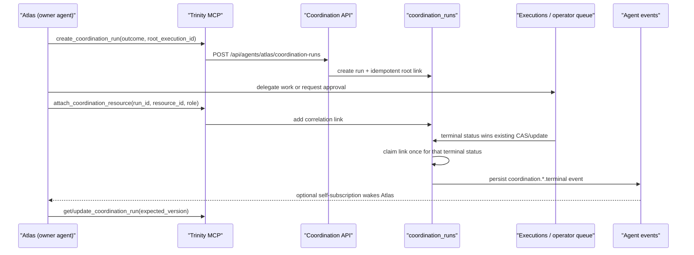

# Coordination Runs

## Purpose

A coordination run is Trinity's durable correlation envelope for one business
outcome that spans agents, executions, and operator decisions. It lets a router
agent such as Atlas answer “what belongs to this initiative?” without copying
execution logs, costs, responses, or approval state out of their existing
systems of record.

It is deliberately not a workflow engine. Stage names, DAG edges, acceptance
criteria, joins, compensation rules, and transition decisions live in the
owning agent's opaque `context` and remain agent-owned.

## Flow

The terminal event types are:

- `coordination.execution.terminal`
- `coordination.operator_queue.terminal`

Each payload contains `coordination_run_id`, `resource_type`, `resource_id`,
`resource_status`, and the agent-defined link `role`. Atlas decides what that
means and uses `expected_version` for compare-and-set updates, preventing two
concurrent resumptions from silently overwriting each other.

## Persistence

- `coordination_runs`: owner agent, outcome, generic lifecycle, opaque JSON
  context, optimistic version, actor, timestamps.
- `coordination_run_resources`: idempotent polymorphic links to an execution or
  operator-queue item, plus replay-safe terminal-notification state.
- `agent_events`: the existing persisted event history and event-subscription
  dispatch path. There is no new heartbeat or polling protocol.

SQLite uses the bespoke migration registry and fresh-schema DDL; PostgreSQL
uses Alembic revision `0015_coordination_runs`. Agent delete/rename follows the
shared agent-cleanup registry, including chained resource-link cleanup.

## Access control

- Read endpoints use agent-access authorization and fail with a uniform 404 for
  an absent or differently owned run.
- Mutations require owner-level access.
- An agent-scoped key may mutate only the coordination runs owned by its bound
  agent. At the MCP layer, permitted agents may read another agent's runs but
  cannot mutate them.
- Attaching a resource verifies that it exists and is accessible to the caller,
  avoiding execution/operator-queue ID disclosure.

## MCP tools

- `create_coordination_run`
- `list_coordination_runs`
- `get_coordination_run`
- `update_coordination_run`
- `attach_coordination_resource`

## Non-goals

- no backend DAG executor or transition matrix
- no duplicated execution response, logs, cost, or status columns
- no automatic interpretation of `context`
- no requirement that every coordination event wakes an agent; self-subscribe
  when immediate re-entry is desired, otherwise read the persisted event/run
  state on the next normal turn
