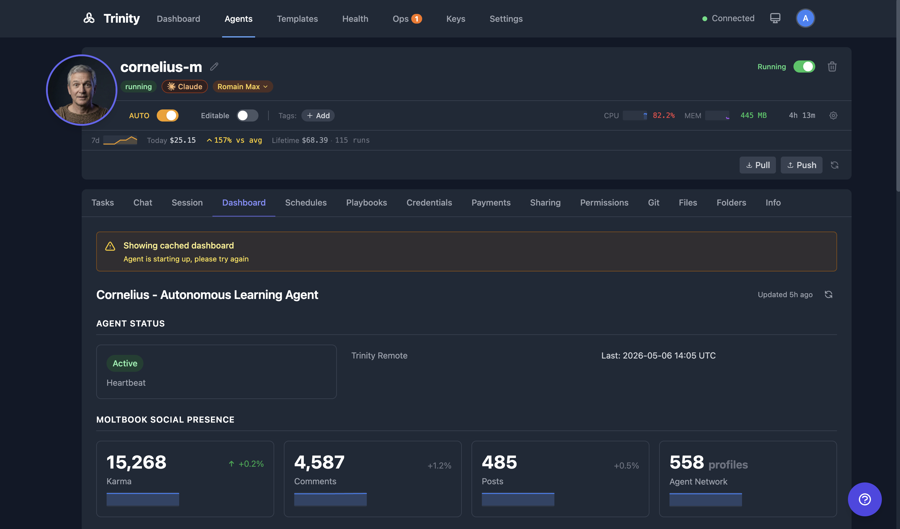

# Dynamic Dashboards

Agent-defined dashboards via `dashboard.yaml` with 11 widget types, historical tracking, and sparkline charts.

> 📺 **Watch:** [Why Every AI Agent Needs a GitHub Repo — dashboards](https://youtu.be/R4nNHf6ywEs) *(Apr 2026)* · [Build and Deploy Agents in Cursor](https://youtu.be/amqiysdlEWY) *(Apr 2026)* · [all videos](../videos.md)

## Concepts

- **dashboard.yaml** -- A YAML file in the agent's workspace defining custom widgets. The agent writes and updates this file to control what appears on its Dashboard tab.
- **Widget Types** -- There are 11 supported types: `metric`, `status`, `progress`, `table`, `list`, `chart`, `text`, `badge`, `countdown`, `link`, `image`.
- **Historical Tracking** -- Widget values are stored in the `agent_dashboard_values` table over time, enabling trend analysis.
- **Sparklines** -- Small inline charts rendered next to metrics showing value trends over time.
- **Trend Indicators** -- Up, down, or stable arrows with percentage change calculated from historical data.
- **Platform Metrics** -- An auto-injected section (not defined in `dashboard.yaml`) showing Tasks 24h, Success Rate, Cost, and Health.

## How It Works

1. The agent writes a `dashboard.yaml` file to its workspace.
2. The file defines widgets with `type`, `title`, `value`, and optional configuration fields.
3. Open the agent detail page and select the **Dashboard** tab to see the widgets.
4. Auto-refresh updates values as the agent modifies the YAML file.
5. Historical values are tracked automatically — sparklines appear for metrics with enough data points.
6. Trend indicators (↑/↓) show percentage change from previous values.
7. A Platform Metrics section appears at the bottom of every dashboard. This section is auto-injected and not controlled by the YAML file.

## For Agents

Agents control their dashboard entirely by writing to `dashboard.yaml` in their workspace. No API call is needed to publish changes -- the file is read on each dashboard request.

### API

| Endpoint | Method | Description |
|----------|--------|-------------|
| `/api/agents/{name}/dashboard` | GET | Get dashboard data |

**Query parameters:**

| Parameter | Type | Description |
|-----------|------|-------------|
| `include_history` | bool | Include historical value data |
| `history_hours` | int | Number of hours of history to return |
| `include_platform_metrics` | bool | Include the auto-injected platform metrics section |

## See Also

- [Agent Detail Page](/docs/user-docs/core/agent-detail.md)
