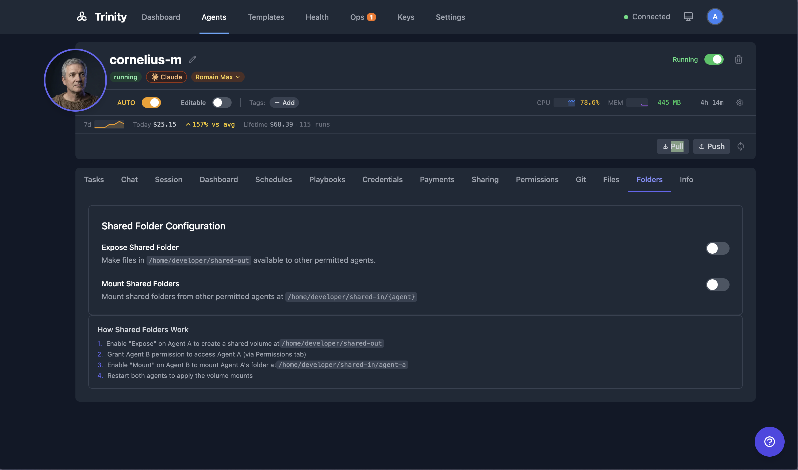

# Agent Network and Collaboration

Agents communicate with each other via Trinity's MCP server, enabling orchestrator-worker patterns, delegation chains, and multi-agent systems.

> 📺 **Watch:** [The Multi-Agent Platform I Run My Company On](https://youtu.be/8j6q-kABRqc) *(May 2026)* · [How We Automate Our Own Ops & Marketing](https://youtu.be/DDhSdwJ1sx8) *(Mar 2026)* · [all videos](../videos.md)

## Concepts

**Agent-to-Agent Communication** -- Agents call each other through Trinity MCP tools using agent-scoped API keys. The `chat_with_agent` MCP tool sends a message to another agent and returns the response.

**Async Collaboration** -- For long-running tasks, use `chat_with_agent(async=true)` which returns an `execution_id` immediately. Poll with `get_execution_result(id)` until complete. This bypasses the 60-second MCP timeout.

**Collaboration Dashboard** -- A real-time visual graph on the Dashboard showing agents as nodes and communication as animated edges. Built with Vue Flow.

**DAG Visualization** -- The network graph shows agent relationships with live activity indicators, success rate bars, and context usage.

**Pull-Pilot Routing (experimental)** -- An alternative routing path for agent-to-agent `chat_with_agent` calls, behind a default-OFF flag (`MCP_AGENT_CHAT_PULL_ENABLED`). When enabled, a sequential agent-to-agent call is dispatched through Trinity's durable async task path instead of a held synchronous call: the caller gets an immediate receipt with an `execution_id` and polls `get_execution_result(id)` for the result. This is an opt-in proof-of-concept for pull/work-stealing coordination. It does not change human chat, parallel calls, or self-calls. Leave it off unless you are piloting it.

## How It Works

1. The Dashboard shows the agent network graph by default.
2. Nodes represent agents, color-coded by status (running = green, stopped = gray).
3. When agents communicate, animated edges appear between nodes (3-second animation).
4. Click a node to navigate to that agent's detail page.
5. Toggle between **Graph** and **Timeline** views.
6. Timeline view shows execution boxes color-coded by trigger type (manual, schedule, MCP, chat) with collaboration arrows between them.
7. Node positions persist in localStorage. Drag nodes to rearrange.

### WebSocket Events

- `agent_collaboration` -- Fired when one agent calls another via MCP.
- `agent_activity` -- State changes (started, completed, failed) for all activity types.
- Source agent is detected via the `X-Source-Agent` header on the chat endpoint.

## For Agents

### MCP Tools

| Tool | Description |
|------|-------------|
| `chat_with_agent(agent_name, message)` | Send a message to another agent and wait for the response. |
| `chat_with_agent(agent_name, message, async=true)` | Send a message asynchronously. Returns an `execution_id`. |
| `get_execution_result(execution_id)` | Poll for the result of an async execution. |
| `list_recent_executions(agent_name)` | List recent executions for an agent. |
| `get_agent_activity_summary(agent_name)` | Activity summary over a configurable time window. |

### Building Multi-Agent Systems

- Use **System Manifests** to deploy pre-configured multi-agent setups.
- Configure **permissions** to control which agents can call which.
- Use **shared folders** for file-based collaboration between agents.
- Use **event subscriptions** for pub/sub patterns between agents.

### Shared Folder Configuration

Agents can share files via Docker volumes:

1. On the **source agent**, open the **Folders** tab and enable **Expose Shared Folder**. Files placed in `/home/developer/shared-out` are made available to permitted agents.
2. Grant the consuming agent permission via the **Permissions** tab.
3. On the **consuming agent**, enable **Mount Shared Folders**. Exposed folders appear at `/home/developer/shared-in/{agent-name}`.
4. Restart both agents to apply the volume mounts.

## See Also

- [Event Subscriptions](./event-subscriptions.md) -- Pub/sub for inter-agent pipelines
- [System Manifest](./system-manifest.md) -- Deploy multi-agent systems from a single file
- [Scheduling](../automation/scheduling.md) -- Automated agent execution
