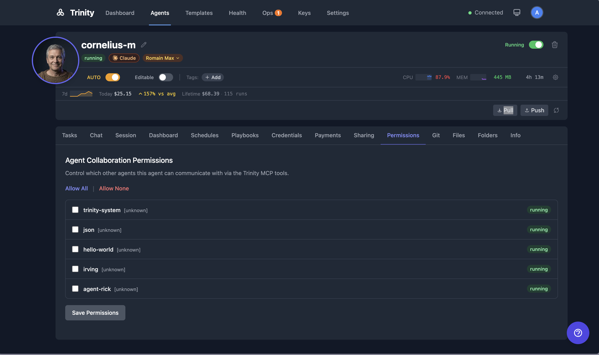

# Agent Permissions

Explicit permission model controlling which agents can communicate with which. Restrictive by default -- no agent can call another without explicit permission.

> 📺 **Watch:** [Trinity Platform Demo](https://youtu.be/ivljtZqsxeo) *(May 2026)* · [all videos](../videos.md)

## How It Works

1. Open the agent detail page and click the **Permissions** tab (located in the agent files/config area).
2. You will see a list of all agents in the system.
3. Toggle permissions to allow or deny each agent from calling the current agent.
4. Permissions are directional: allowing Agent A to call Agent B does **not** allow Agent B to call Agent A. Each direction must be granted separately.
5. System agents (e.g., `trinity-system`) bypass permission checks entirely.

**Default behavior:**

- No permissions are auto-granted. All inter-agent communication must be explicitly allowed.
- The system agent (`trinity-system`) can call any agent without requiring permission.

**Enforcement:**

- When Agent A attempts to call `chat_with_agent("agent-b", ...)`, the MCP server checks whether Agent A has permission to communicate with Agent B.
- If permission has not been granted, the MCP tool returns an error and the call is blocked.
- Permissions also gate shared folder access and event subscriptions between agents.

## For Agents

- Permissions are managed through the agent files/config endpoints. Agents do not need to handle permissions themselves.
- All MCP tools respect the permission model automatically. If a tool call targets another agent, the permission check happens before execution. No special handling is required in agent code.

## See Also

- [Agent Network](agent-network.md) -- how agents discover and communicate with each other
- [Event Subscriptions](event-subscriptions.md) -- pub/sub messaging between agents (gated by permissions)
