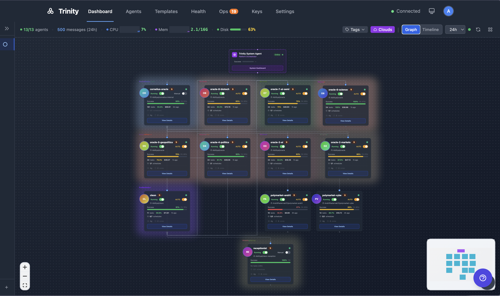
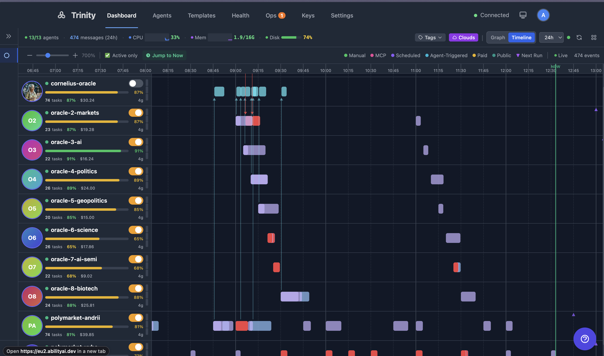

# Dashboard

The main Dashboard at `/` monitors all agents and their activities in real time. Switch between three view modes with the toggle in the top-right — **Grid**, **Graph**, and **Timeline**. Timeline is the default; your choice persists per browser in `localStorage['trinity-dashboard-view']`.

> 📺 **Watch:** [The Multi-Agent Platform I Run My Company On](https://youtu.be/8j6q-kABRqc) *(May 2026)* · [all videos](../videos.md)

## How It Works

### Grid View

A magnetic tile canvas — the fleet as a grid of agent cards rather than a graph or a timeline. Each agent is a five-zone tile showing its avatar, runtime badge, and inline **Running** and **Autonomy** toggles, plus live status chips (git sync health, pending operator-queue items).

1. Drag a tile to move it; drop it onto another tile to **swap** positions. The layout snaps to an unbounded lattice and is saved per user.
2. **Tidy** re-packs the tiles into a compact arrangement without losing your ordering.
3. **Reset** restores the default auto-generated layout.
4. Pan by dragging the background; zoom with the scroll wheel or pinch. Tiles are keyboard-navigable.
5. Tile metrics hydrate lazily as they scroll into view, so large fleets stay responsive.

### Graph View

1. Shows all agents as draggable nodes in a network graph (Vue Flow).
2. Node colors indicate status: running (green), stopped (gray).
3. Animated edges appear when agents communicate (3-second animation).
4. Each node displays the agent name, avatar, success rate bar, and status indicator.
5. Drag nodes to rearrange -- positions persist in localStorage.
6. Host telemetry (CPU/memory/disk) is displayed in the header.
7. Capacity meter shows parallel execution slot usage.
8. Tag clouds group agents visually — click a cloud to filter to that group.

### Timeline View (default)

1. Timeline shows execution boxes per agent, arranged chronologically.
3. Color-coded by trigger type: Manual (green), MCP (pink), Scheduled (purple), Agent-Triggered (cyan), Paid (yellow), Public (teal).
4. Each row shows the agent's success rate, total cost, and parallel slot count.
5. Live streaming: running executions show progress in real-time with a "Live" indicator.
6. Time range filter: 1h, 6h, 24h, 7d, or custom.
7. **Active only** toggle hides agents with no recent activity.
8. **Jump to Now** snaps the view to the current time.

### Tag Clouds

Agents are grouped visually by tags on the Dashboard. Click a tag cloud to filter the view to that group.

### Activity Feed

A real-time WebSocket-driven activity stream showing agent collaborations, task starts/completions, schedule executions, and errors.

## For Agents

| Endpoint | Method | Description |
|----------|--------|-------------|
| `/api/agents` | GET | List all agents |
| `/api/agents/context-stats` | GET | Context and activity state for all agents |
| `/api/agents/autonomy-status` | GET | Autonomy status for all agents |
| `/api/activities/timeline` | GET | Cross-agent activity timeline (filterable) |
| `/api/telemetry/host` | GET | Host CPU/memory/disk |

## See Also

- [Managing Agents](../agents/managing-agents.md)
- [Scheduling](../automation/scheduling.md)
- [Operations Page](operating-room.md) -- Operator queue, health, and fleet executions
