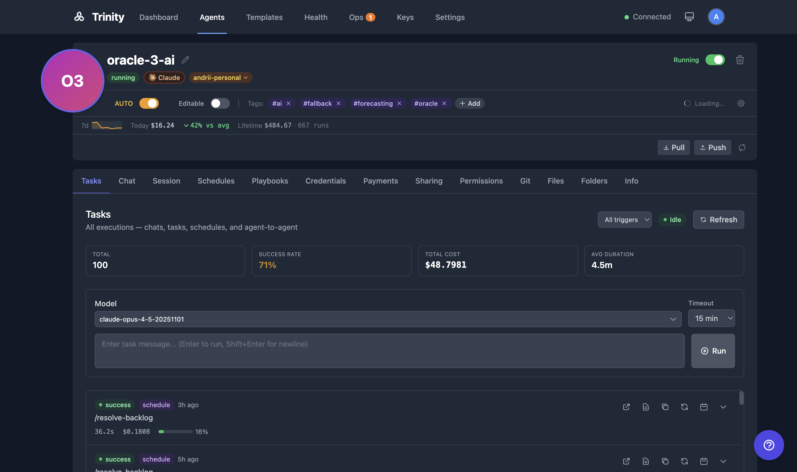

# Executions

View, monitor, and manage task executions across all agents. Executions are created by manual tasks, schedules, MCP calls, and chat interactions.

## Concepts

**Execution** -- A single run of a task on an agent. Each execution records: status, started_at, completed_at, duration, message, response, error, cost, model_used, triggered_by, and claude_session_id.

**Trigger Types** -- How an execution was initiated:

| Trigger | Source |
|---------|--------|
| `manual` | Tasks tab in agent detail |
| `schedule` | Cron-based schedule |
| `mcp` | Agent-to-agent call via MCP |
| `chat` | Chat tab in agent detail |
| `paid` | x402 payment-gated request |

**Execution Status** -- Every execution moves through a lifecycle: `pending` -> `running` -> `completed`, `failed`, or `cancelled`.

**Parallel Capacity** -- Each agent has a configurable slot system (default: 3 concurrent slots). Slot TTL equals the agent timeout plus a 5-minute buffer. When all slots are occupied, new executions queue until a slot frees up.

**Task Execution Service** -- A unified execution lifecycle layer used by all callers (UI, schedules, MCP, chat, paid). Handles slot management, activity tracking, and input sanitization.

**Live Streaming** -- Running executions stream logs in real time via Server-Sent Events (SSE) to the Execution Detail page.

## How It Works

### Execution List Page (`/executions`)

1. Lists all executions across all agents.
2. Filter by agent, status, trigger type, or date range.
3. Click any execution row to open its detail page.

### Execution Detail Page

1. Displays agent name, status, timestamps, duration, cost, model used, and trigger source.
2. Shows the full transcript/log of the Claude Code execution.
3. For running executions, a green pulsing "Live" indicator streams output in real time.
4. **Stop** button terminates a running execution.
5. **Continue as Chat** button resumes the execution as an interactive chat session.

### Tasks Tab (per-agent)

1. Open agent detail and click the **Tasks** tab.
2. Enter a task message. Optionally select a model.
3. Click **Send** to start the execution.
4. View execution history with status and duration.
5. A green pulsing "Live" badge links directly to the running execution.
6. Use **Make Repeatable** to create a schedule from any completed task.

### Execution Termination

- Stop running executions via the **Stop** button on the detail page.
- The system sends SIGINT first, then SIGKILL if the process does not exit.
- Queue slots are released and activity is tracked.

## For Agents

### API

| Endpoint | Method | Description |
|----------|--------|-------------|
| `/api/agents/{name}/executions` | GET | List executions for an agent |
| `/api/agents/{name}/executions/{id}` | GET | Get execution details |
| `/api/agents/{name}/task` | POST | Submit a new task |

### MCP Tools

| Tool | Description |
|------|-------------|
| `list_recent_executions(name)` | List recent executions for an agent |
| `get_execution_result(id)` | Get the result of a specific execution |
| `get_agent_activity_summary(name)` | Get activity summary including execution stats |

## See Also

- [Schedules](../agents/schedules.md) -- Automate recurring executions with cron
- [Chat](../agents/chat.md) -- Interactive chat sessions with agents
- [Monitoring](monitoring.md) -- Fleet-wide health and activity monitoring
