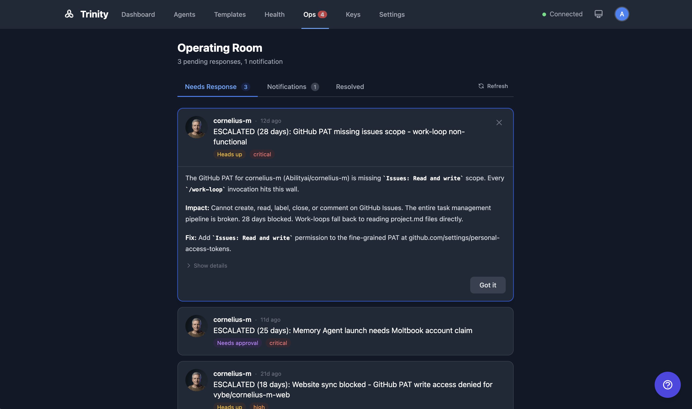

# Operating Room

Unified operator command center with four tabs -- Queue, Notifications, Cost Alerts, and System -- providing real-time visibility into agent operations that require human attention.

## How It Works

### Queue Tab

Shows items from agents' operator queues: questions, approval requests, and status updates.

- Agents write to `~/.trinity/operator-queue.json` inside their container.
- A background sync service polls running agents every 5 seconds and persists items to the backend database.
- Operators can respond to items directly; responses are written back to the originating agent.
- Filter by status, type, priority, or agent name.
- WebSocket events: `operator_queue_new`, `operator_queue_responded`, `operator_queue_acknowledged`.

### Notifications Tab

Consolidated view of agent notifications (replaces the former standalone Events page).

- Filter by status, priority, agent, or type.
- Stats cards display counts by status.
- Bulk selection and bulk actions.
- Real-time updates via WebSocket.

### Cost Alerts Tab

Cost threshold monitoring and alerting (replaces the former standalone Alerts page). Configure cost thresholds per agent or globally.

### System Tab

System-level information and controls.

### Sync Service

- Restart-resilient sync between agent containers and the backend database.
- Manual refresh button available.
- Stale prompt detection flags items older than expected.

### Sync Health Alerts

For agents with GitHub sync enabled, the Sync Health Service polls every 60 seconds and writes `sync_failing` queue entries when an agent's `consecutive_failures` hits 3. These appear in the Queue tab alongside agent-emitted items, so a broken git remote, expired PAT, or upstream divergence surfaces in the same place operators already watch.

Per-agent sync state (last sync at, last error, ahead/behind counts on `main` and the working branch) is also visible on the agent header dot and at `GET /api/agents/{name}/git/sync-state`.

## For Agents

### Operator Queue API

| Endpoint | Method | Description |
|----------|--------|-------------|
| `/api/operator-queue` | GET | List queue items |
| `/api/operator-queue/stats` | GET | Queue statistics |
| `/api/operator-queue/{id}` | GET | Get single item |
| `/api/operator-queue/{id}/respond` | POST | Submit response |
| `/api/operator-queue/{id}/cancel` | POST | Cancel item |
| `/api/operator-queue/agents/{name}` | GET | Items for a specific agent |

### MCP

`send_notification(agent_name, message, priority)` -- sends a notification to the Operating Room from within an agent.

## See Also

- [Dashboard](dashboard.md)
