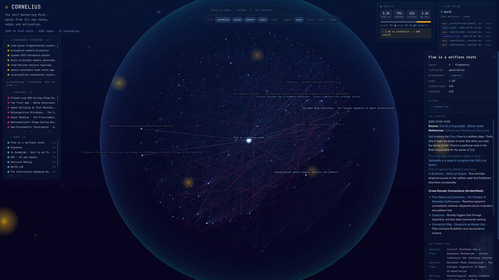
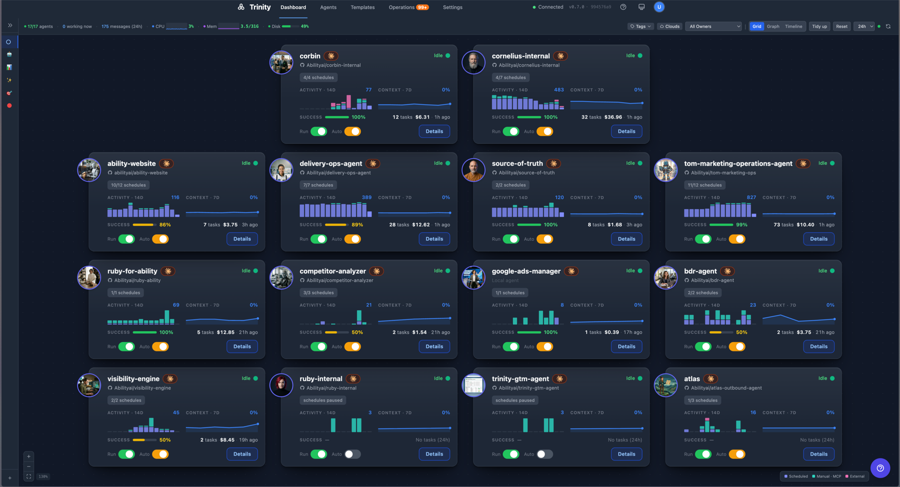
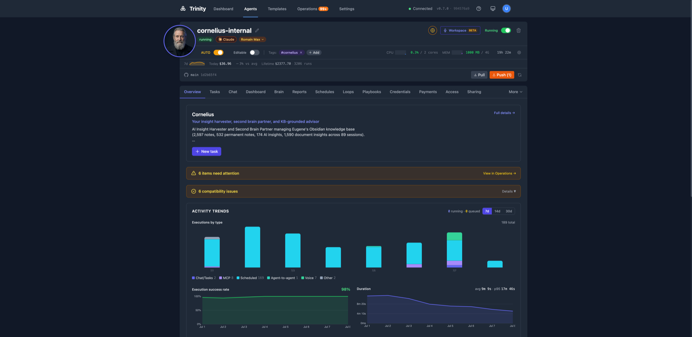
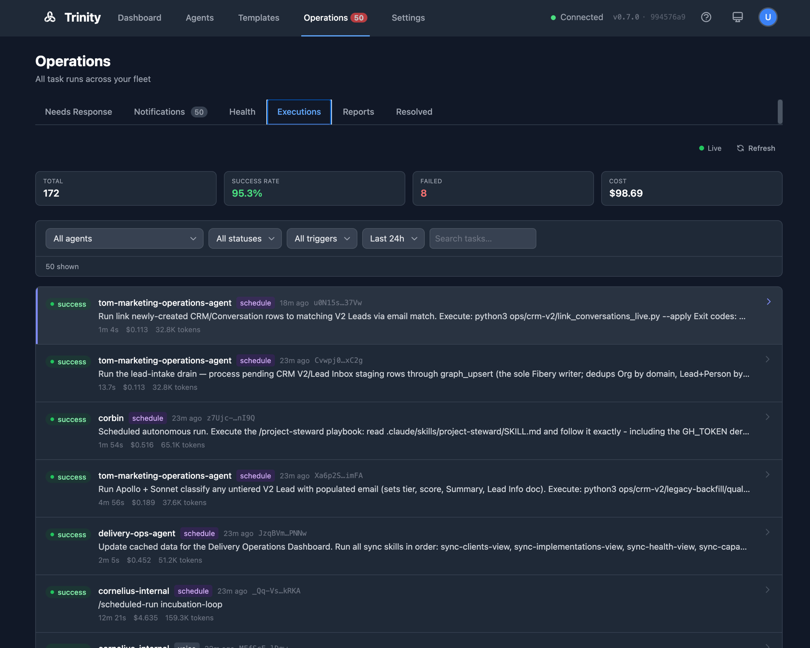

# What's New in Trinity v0.8.0

*Released 2026-07-08*

[](https://youtu.be/wxCC6QGtLMA)
*▶ [Watch the release tour on YouTube](https://youtu.be/wxCC6QGtLMA) — a walkthrough of everything below.*

Trinity's largest release yet. Agents can now **speak** — replies arrive as real voice notes on Telegram, Slack, and WhatsApp — and second-brain agents get the **Brain Orb**, a living 3D map of everything the agent knows, with voice conversation and capture-to-graph writes. Fleet operators get a new **Grid dashboard** and a redesigned sharing model, and the enterprise tier gains its **identity layer**: two-factor authentication, single sign-on, and per-agent operator access control.

## Improvements

### Agents speak — voice replies across channels

Flip one toggle and your agent answers with a spoken voice note instead of (or alongside) text — on **Telegram**, **Slack**, and **WhatsApp**. Pick the voice per agent; delivery falls back to text automatically if synthesis fails. Configure under the agent's Sharing settings (requires a platform ElevenLabs key). The Gemini Live voice picker also gained a new voice, **Gacrux**, for real-time voice chat and phone calls.

### The Brain Orb — watch your agent think



Second-brain agents now render their own mind: a 3D knowledge graph you can search, navigate, and **talk to** — the voice tile connects your browser straight to Gemini Live. Capture a note or link mid-conversation and watch it appear on the graph; voice-session transcripts are saved and processed automatically after the call ends. Fresh Trinity installs auto-seed a ready-to-use **Cornelius** agent so the orb works out-of-the-box, and the new **fork-to-own** flow copies the agent template into your own GitHub repo at creation, so your knowledge base lives in a repository you control.

### Grid dashboard — the whole fleet at a glance



A third fleet view alongside Graph and Timeline: a magnetic tile canvas where every agent is a card with live activity sparklines, success rate, task counts, cost, and run/autonomy toggles. Drag to arrange, and your layout sticks.

### The agent page, unified



The agent page consolidates into one command center. **Chat and Session merge into a single Chat tab** with conversation continuity on by default (toggle off for stateless mode). New tabs appear where the agent supports them: **Brain** (the orb), **Reports** (structured results the agent publishes), **Access** (which operators can reach this agent, active vs pending), and a **Sharing tab reframed around external clients** — the people who reach your agent through channels — with per-channel setup dialogs and a client roster showing who's been talking to it.

### Operations — every run accounted for



The Operations area now shows every execution across the fleet with standardized cost display throughout the UI — including runs triggered by voice sessions and channel messages, not just schedules. Admins can turn fleet-health monitoring on or off from Settings, and the choice survives restarts.

### More improvements

- **Loop guardrails** — sequential agent loops accept a hard cost budget and a wall-clock deadline, and stop automatically when the agent starts repeating itself (doom-loop detection).
- **Webhook signing** — protect schedule webhooks with optional HMAC signatures so a leaked URL alone can't trigger work, managed from a full webhook panel on the Schedules tab.
- **Agents as MCP tools** — expose any agent as a dedicated tool in Claude Code or any MCP client with one toggle; the tool appears without a restart.
- **Public-conversation controls** — set a different model and custom instructions that apply only to public links and channel chats, without affecting your own sessions.
- **Broader credential support** — inject service-account keys, PEM certificates, SSH keys, and cloud CLI configs, not just environment files.
- **Credential key rotation** — rotate the platform's credential encryption key online, with no downtime.
- **Fleet capacity ceiling** — admins set a platform-wide cap on per-agent parallel tasks; owners pick within it.
- **Direct git operations** — agent git status, sync, log, and pull are available as fast deterministic tools, no chat round-trip.
- **Pipeline visibility** — agents that run multi-stage pipelines can publish their progress for inspection over MCP.
- **In-app documentation link** — every instance links to the hosted docs site.

## Fixes

- **Large fleets no longer saturate the backend** — a CPU-churn issue with ~30 agents (connection storms and polling) is resolved.
- **Schedules can't silently stall** — a bug where an enabled schedule showed "Next: 1 day ago" and quietly stopped firing is root-fixed, with a watchdog to catch any recurrence.
- **Busy agents aren't marked broken** — health probes during long, CPU-heavy work no longer trip the circuit breaker, and fleet monitoring no longer double-checks agents when running multiple server workers.
- **Slack behaves like a person** — the bot posts under the agent's name and avatar, sees who's speaking and in which channel, can message channels proactively, and keeps separate conversations per thread instead of per channel.
- **Webhooks under load** — valid webhook URLs intermittently returned "not found" under concurrent traffic; repeated triggers were silently swallowed for 24 hours; webhooks of deleted agents kept firing. All fixed.
- **Files tab previews work again** for text and media files.
- **Chats always save** — an async chat that finished in the background could complete without ever appearing in history; long-running session turns no longer show a false "failed to send."
- **Local development on Docker Desktop** — log collection no longer pegs the Docker VM's CPU.
- **UI polish** — Trinity favicon and per-page browser titles, loading skeletons instead of frozen screens, chat width no longer jumps between tabs, task lists fill the viewport.

## Security & Hardening

- **Logging out now revokes the session** — a stolen token dies with the logout instead of remaining valid for its full lifetime.
- **Agent and user names can no longer be probed** — API responses are uniform whether or not a resource exists.
- **Two dozen dependency vulnerabilities** remediated across the platform.
- **Code-scanning hardening** — stricter URL validation, sanitized Brain Orb rendering, and tightened file-path containment in the agent server.
- **Public webhooks** gained rate limits and request-size caps.

## Enterprise

Available on the enterprise tier:

- **Two-factor authentication (TOTP)** — mandatory for admin accounts, optional for everyone else.
- **Single sign-on (SAML/OIDC)** for enterprise identity providers.
- **Fleet permissions matrix** — one Settings grid controlling which agents may call which.
- **MCP connector** — expose selected agent playbooks as tools for end-user consumption, with a Sharing-tab picker.
- **Client Portal (first slice)** — configurable exposure for an external-client web surface, including private/VPN deployments.

## Ecosystem — Abilities toolkit

The [abilities](https://github.com/abilityai/abilities) plugin marketplace moved alongside this release:

- **Orchestrator installer** *(agent-dev, new)* — one command turns any agent into a system-aware orchestrator: discover Trinity-compatible agents across repos, compose them into a deployable system manifest, then route and fan out work across the fleet.
- **Report publishing built into new agents** *(create-agent)* — agents generated by the wizards ship ready to publish structured reports to the new Reports surface.
- **Safer syncing** *(trinity)* — pulling changes now stashes local edits instead of discarding them.
- **Long-running-task guidance** — playbook templates and onboarding now teach the correct shape for jobs longer than ~10 minutes: decouple to system schedulers with a completion marker.

```
/plugin marketplace add abilityai/abilities
```

## Upgrade Notes

- **Enterprise admins**: two-factor authentication is mandatory once the module is entitled — you'll be prompted to enroll an authenticator app at next login.
- **First-time setup changed**: the setup token is gone; the wizard requires an admin email. Keep a brand-new instance behind a VPN or tunnel until setup completes.
- Re-login after upgrading (sessions rotate on backend restart) and reconnect MCP clients.
- Carried from v0.7.0: PostgreSQL is the recommended production backend; SQLite support ends September 1, 2026.

## See Also

- [Voice Chat](../advanced/voice-chat.md)
- [Agent Sharing](../sharing-and-access/agent-sharing.md)
- [Scheduling](../automation/scheduling.md)
- [Abilities Marketplace](../automation/abilities-marketplace.md)
- [Release notes (technical)](../../releases/0.8.0.md)
